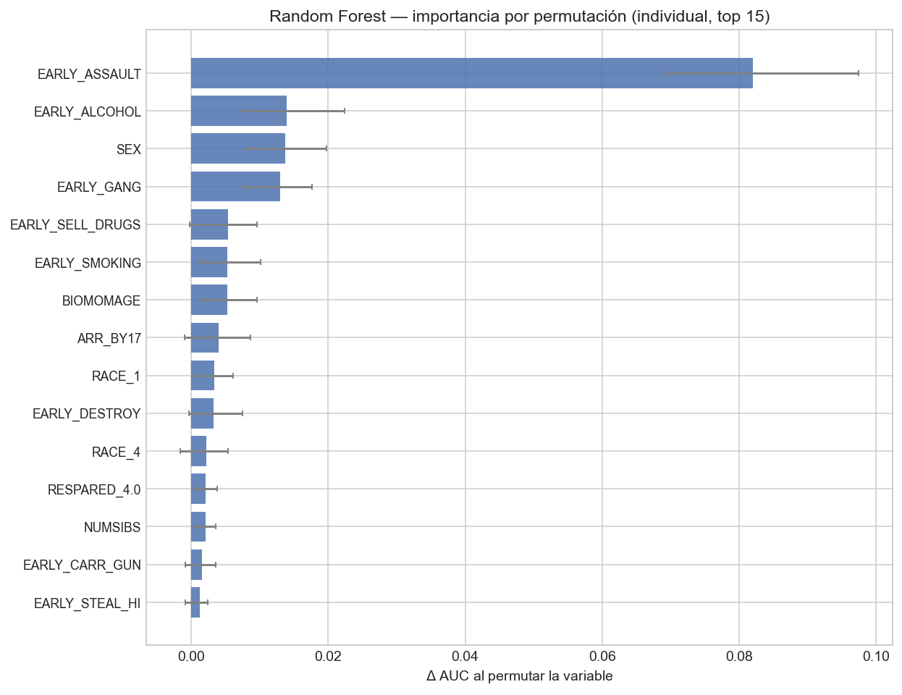
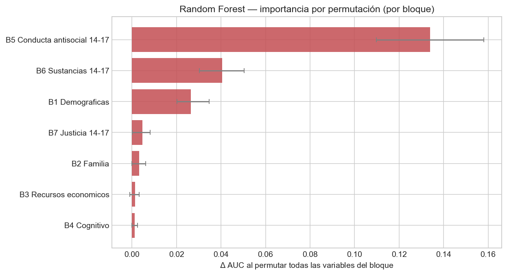
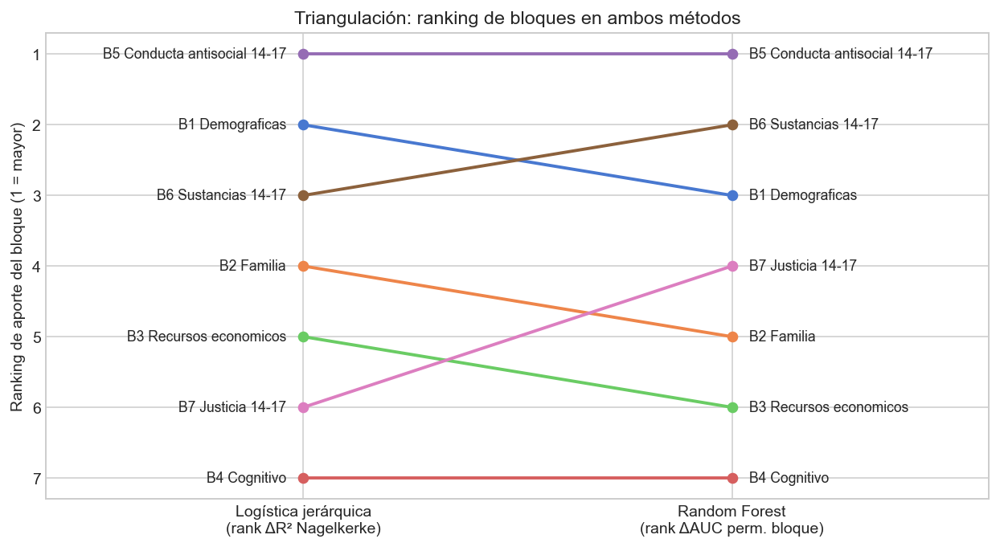

# Mérito intelectual del proyecto

La violencia juvenil nos parece un problema importante de política pública porque no termina en el momento del acto violento. Afecta a las víctimas, a las familias, a las escuelas y también a las oportunidades futuras de quienes la ejercen. Varios estudios encuentran que las conductas antisociales en edades tempranas pueden repetirse más adelante, aunque no toda persona que agrede en la adolescencia lo hace en la adultez [@moffitt1993; @sampsonlaub1993]. Desde ahí surge la pregunta que organiza este trabajo: qué tanto se puede anticipar la agresión física posterior usando información medida antes de que ocurra, y qué tipo de información aporta más.

La literatura ofrece dos formas de pensar la continuidad de la conducta antisocial. Una sostiene que algunas personas son más propensas a involucrarse en conductas de riesgo porque tienen menos autocontrol, por lo que la conducta temprana debería predecir la posterior [@gottfredsonhirschi1990]. La otra dice que el entorno también pesa: cuando los vínculos con la familia, la escuela o la comunidad son débiles, la probabilidad de conductas problemáticas aumenta [@hirschi1969]. Para política pública la diferencia es importante. Si lo determinante es la conducta previa, habría que enfocarse en quienes ya reportaron agresión. Si el entorno también pesa, las intervenciones tempranas en condiciones familiares, escolares y económicas tienen sentido.

Este trabajo se diferencia de la versión previa por un cambio metodológico explícito. En vez de comparar muestras separadas con un solo modelo no paramétrico, estimamos siete regresiones logísticas anidadas sobre la muestra completa, organizadas en bloques temáticos que van de variables más exógenas (sexo, raza, edad de la madre) a más proximales (conductas de la propia persona en la adolescencia). Cada bloque entra encima del anterior y reportamos cuánto cambia el ajuste con pruebas de razón de verosimilitudes y con el pseudo-R$^2$ de Nagelkerke. En paralelo, ajustamos un *random forest* sobre los mismos predictores y calculamos importancia por permutación a nivel individual y, lo que es central a nuestro diseño, a nivel de bloque. Esto resuelve el problema conocido de que variables correlacionadas se cubren entre sí en la permutación individual y dejan de aparecer como importantes [@strobl2007]. Permutar las variables de un bloque al mismo tiempo recupera el aporte conjunto.

El resultado relevante para el lector es que el ordenamiento de bloques es estable entre el método paramétrico y el no paramétrico: las conductas antisociales tempranas dominan, seguidas por sustancias y por contacto temprano con el sistema de justicia. La triangulación entre logística jerárquica y random forest nos da más confianza en este ordenamiento que cualquiera de los dos métodos por separado, y conecta con la discusión clásica de @nagin1991 y con la síntesis de predictores de violencia juvenil de @lipseyderzon1998.

# Variables y datos

Usamos los datos del estudio ICPSR 34562, preparado por el Bureau of Justice Statistics con base en la Encuesta Nacional Longitudinal de la Juventud de 1997, conocida como NLSY97 [@icpsr34562]. Esta encuesta siguió a 8,984 personas nacidas en Estados Unidos entre 1980 y 1984. En la base, varias preguntas no están guardadas por año de entrevista sino por la edad de la persona cuando respondió. La NLSY97 usa códigos especiales para distinguir respuestas como no sabe, no contestó, entrevista no realizada o pregunta no aplicable, que en nuestro procesamiento tratamos como valores faltantes porque no representan una respuesta sustantiva. Para estimar los modelos con una matriz completa imputamos las variables explicativas con su mediana.

La variable dependiente principal, $Y_i \in \{0,1\}$, toma el valor de uno si la persona reportó haber agredido físicamente a alguien con intención de hacerle daño en al menos una ocasión entre los 18 y los 23 años, y cero en caso contrario. Decidimos no usar los datos de los 24 y 25 años porque en esa parte aparecen observaciones de una submuestra de personas en prisión, lo que inflaría artificialmente la prevalencia para la cohorte completa. De las 8,984 personas en la muestra original, 8,609 tienen al menos una respuesta válida para esta variable. Dentro de ese grupo, 16.9 por ciento reportó haber agredido a alguien entre los 18 y los 23 años.

Todas las variables explicativas se midieron antes del periodo que queremos predecir. Las variables del levantamiento inicial de 1997 son estáticas en la edad. Las conductas observadas entre los 14 y los 17 años se colapsan a indicadores de la forma "alguna vez en la ventana 14-17", lo que mantiene una sola fila por persona y evita usar información contemporánea al resultado. Las variables continuas con relaciones potencialmente no lineales (razón de pobreza, ingreso del hogar 14-17, habilidad cognitiva ASVAB) se discretizan en cuartiles, con el cuartil más alto como referencia. Esto permite leer los coeficientes directamente como cocientes de riesgo respecto al grupo más aventajado, y evita imponer una forma funcional lineal.

Organizamos las variables en siete bloques temáticos cuya teoría se vuelve más proximal al joven a medida que aumenta el número del bloque. El primero contiene variables fijas o casi fijas al nacer (sexo, raza o etnicidad, edad de la madre al nacer, número de hermanos). El segundo refleja el entorno de crianza (estructura familiar en 1997 y educación máxima de los padres). El tercero captura los recursos económicos del hogar (razón de pobreza en 1997 y promedio del ingreso del hogar entre los 14 y los 17 años, ambos en cuartiles). El cuarto es el capital cognitivo medido con el puntaje ASVAB en cuartiles. El quinto agrupa las conductas antisociales tempranas reportadas entre los 14 y los 17 años: agresión, destrucción de propiedad, robo bajo y alto, y venta de drogas. El sexto cubre las conductas paralelas de riesgo y consumo en la misma ventana (alcohol, marihuana, drogas duras, tabaco, portación de arma y pertenencia a pandilla). El séptimo concentra el contacto con el sistema de justicia hasta los 17 años (arresto y encarcelamiento). Tras la expansión de las categóricas y los cuartiles, el modelo completo tiene 35 predictores, manteniendo una razón observaciones por parámetro cercana a 246.

# Diseño empírico general

El diseño es asociativo y predictivo. No interpretamos los coeficientes como efectos causales: el orden temporal entre predictores y resultado garantiza que la información medida en 1997 y entre los 14 y los 17 años no esté contaminada por el outcome, pero no descarta la presencia de variables omitidas o relaciones espurias. La pregunta empírica se centra en qué bloques de información son los que más reducen la incertidumbre sobre quién reportará agresión adulta, no en cuál sería el efecto causal de modificar una variable concreta.

## Regresión logística anidada con siete bloques

Estimamos siete modelos logísticos $M_1, M_2, \dots, M_7$. El modelo $M_m$ incluye todos los bloques de $1$ a $m$ y, formalmente, especifica
$$
\text{logit}\big(P(Y_i = 1)\big) \;=\; \alpha_m + \sum_{b=1}^{m} \mathbf{X}_i^{(b)\top} \boldsymbol{\beta}^{(b)},
$$
donde $\mathbf{X}_i^{(b)}$ es el vector de variables del bloque $b$ para la persona $i$ y $\boldsymbol{\beta}^{(b)}$ el vector de coeficientes correspondiente. Estimamos por máxima verosimilitud y reportamos errores estándar robustos a heterocedasticidad tipo Huber-White en el modelo final. Para comparar modelos anidados usamos la prueba de razón de verosimilitudes,
$$
\mathrm{LR}_{m \to m+1} \;=\; 2 \big[\,\ell(M_{m+1}) - \ell(M_m)\,\big] \;\sim\; \chi^2_{k},
$$
donde $\ell(\cdot)$ es la log-verosimilitud y $k$ es el número de parámetros nuevos del bloque agregado. Bajo la hipótesis nula de que el bloque adicional no aporta información, el estadístico sigue una $\chi^2_k$. Reportamos también el cambio en la deviance, en el AIC y en el pseudo-R$^2$ de Nagelkerke. Esta forma de tabular siete modelos anidados con su prueba de razón de verosimilitudes secuencial es la versión logística del *anova* tradicional [@hosmerlemeshow2013]. La elección de cuartiles para las continuas se justifica por su interpretación directa, su robustez a no linealidades y su consistencia con la práctica habitual en estudios de movilidad y resultados adultos.

## Random forest e importancia por permutación

En paralelo entrenamos un *random forest* con los mismos predictores [@breiman2001]. Usamos $B = 500$ árboles, profundidad máxima de 10, mínimo de 20 observaciones por hoja, $\sqrt{p}$ variables candidatas por nodo y pesos balanceados por la clase minoritaria. Separamos 20 por ciento de los datos como muestra de prueba estratificada y validamos con cinco pliegues sobre la muestra completa.

Reportamos el AUC fuera de muestra y, para interpretar el bosque, calculamos importancia por permutación. La versión individual, donde se permuta una sola variable a la vez, sigue la expresión
$$
PI_j \;=\; A - \frac{1}{R}\sum_{r=1}^{R} A_{\pi_j^{(r)}},
$$
con $A$ el AUC original y $A_{\pi_j^{(r)}}$ el AUC tras permutar la variable $j$ en la repetición $r$, con $R=30$. Esta medida tiene un problema documentado: cuando dos variables son redundantes, permutar solo una deja al modelo con la información en la otra y ambas aparecen como poco importantes [@strobl2007]. Por eso reportamos también la versión por bloque, donde permutamos al mismo tiempo *todas* las variables del bloque $b$:
$$
PI_{\text{bloque }b} \;=\; A - \frac{1}{R}\sum_{r=1}^{R} A_{\pi_{(b)}^{(r)}},
$$
con $\pi_{(b)}^{(r)}$ una permutación independiente de cada columna del bloque en la misma repetición. Esto recupera el aporte conjunto del bloque y, al usar los mismos siete bloques de la logística anidada, permite comparar directamente los rankings de aporte entre el método paramétrico y el no paramétrico. Reportamos las importancias con su media e intervalos de confianza al 95 por ciento construidos por percentiles de las repeticiones.

## Triangulación entre métodos

La validez del ordenamiento de bloques se evalúa con dos criterios. Primero, las pruebas de razón de verosimilitudes deben ser significativas en los bloques que realmente aporten. Segundo, los rankings derivados del $\Delta R^2_{\text{Nagelkerke}}$ de la logística y del $\Delta\mathrm{AUC}$ por permutación del *random forest* deben coincidir en sus puestos altos. Cuando los dos métodos llegan al mismo bloque dominante, el resultado es robusto a la elección de función funcional. Cuando difieren, hay no linealidad o interacciones que el método paramétrico no captura, y eso es información sustantiva sobre el problema.

# Resultados

## Aporte secuencial de los siete bloques

La Tabla 1 reporta el resumen de los siete modelos anidados con la prueba de razón de verosimilitudes y el cambio en el pseudo-R$^2$ de Nagelkerke. La estructura del cuadro es la de un *anova* logístico estándar. El primer modelo, que sólo contiene el bloque demográfico, alcanza un pseudo-R$^2$ de 0.045 y deja la deviance en 7,586.8. Al agregar el bloque de familia y capital social, la deviance baja 54.6 puntos con siete grados de libertad ($p<10^{-8}$). El bloque de recursos económicos resta otros 41.3 puntos a la deviance ($p<10^{-6}$). El bloque cognitivo aporta un cambio menor pero todavía significativo (LR$=10.0$, $p=0.019$).

El salto cualitativo ocurre con el quinto bloque, el de conducta antisocial temprana, que reduce la deviance en 645.4 puntos con cinco grados de libertad y eleva el pseudo-R$^2$ de Nagelkerke de 0.065 a 0.181. En una sola entrada, este bloque acumula más cambio en R$^2$ que la suma de los cuatro anteriores. Los bloques de sustancias y de justicia, que entran después, agregan 146.4 y 33.0 puntos de razón de verosimilitudes respectivamente, ambos con $p$ muy bajos. El pseudo-R$^2$ final del modelo M7 es 0.212 y el AIC pasa de 7,602.8 en M1 a 6,728.2 en M7.

Los coeficientes del modelo completo (Tabla 2) son consistentes con el resultado anterior. La agresión temprana es el predictor con mayor magnitud en log-odds (coef $=1.06$, $z=14.3$, $OR=2.90$). Le siguen el consumo temprano de alcohol ($OR=1.91$), el arresto antes de los 17 años ($OR=1.80$), el sexo masculino ($OR=1.65$), la venta temprana de drogas ($OR=1.48$) y la pertenencia a pandilla ($OR=1.45$). Los cuartiles bajos del ingreso del hogar entre los 14 y los 17 años aparecen con coeficientes positivos significativos respecto al cuartil superior, indicando que la desventaja económica preserva una asociación independiente después de controlar por todo lo demás. La razón de pobreza muestra un patrón mixto que probablemente recoja parte de la información ya capturada por el ingreso del hogar.

La Figura 1 del anexo presenta la trayectoria de los coeficientes top a lo largo de los siete modelos anidados. La lectura es informativa: el coeficiente del sexo masculino arranca cerca de $0.83$ en M1 y baja a $0.50$ en M7, lo que indica que parte de la asociación bruta entre sexo y agresión adulta pasa por las conductas tempranas. El coeficiente del arresto antes de los 17 años se mantiene relativamente estable entre M5, M6 y M7, lo que sugiere que captura información que no se reduce a las conductas reportadas por la propia persona.

## Importancia del random forest, individual y por bloque

El *random forest* obtuvo un AUC de 0.796 en la muestra de prueba y de 0.767 en validación cruzada de cinco pliegues (desviación estándar 0.027). La permutación individual, que se reporta en la Figura 2 del anexo, replica el patrón de los coeficientes: la agresión temprana es la variable más importante con un $\Delta\mathrm{AUC}$ de 0.082, seguida por el consumo temprano de alcohol, el sexo, la pandilla y la venta de drogas, todas con intervalos del 95 por ciento estrictamente positivos.

La Figura 3 del anexo presenta la permutación por bloque, que es el output central de nuestro diseño. El bloque de conducta antisocial temprana acumula un $\Delta\mathrm{AUC}$ de 0.134, casi cuatro veces el del siguiente bloque. El bloque de sustancias y riesgo aparece en segundo lugar con 0.041, y el demográfico en tercero con 0.026. Los bloques de familia, recursos económicos, cognitivo y justicia tienen aportes pequeños o no distinguibles de cero una vez que se permutan junto con los demás predictores del modelo. Esto no significa que esas variables sean irrelevantes en términos absolutos: en la logística anidada sus bloques sí contribuyen a la verosimilitud. Lo que dice la permutación por bloque es que, una vez que el bosque ya tiene la información de la conducta temprana, la señal residual de los bloques distales es pequeña.

## Triangulación entre los dos métodos

La Tabla 3 del anexo compara el ranking de bloques derivado del $\Delta R^2_{\text{Nagelkerke}}$ de la logística con el ranking derivado del $\Delta\mathrm{AUC}$ por permutación del *random forest*. La coincidencia en el puesto principal es completa: el bloque de conducta antisocial temprana domina en ambos métodos. El bloque de sustancias y riesgo aparece en el segundo o tercer lugar en ambos. El bloque demográfico ocupa el segundo lugar en la logística y el tercero en el bosque, una pequeña diferencia atribuible a que el sexo entra como variable única en lugar de bloque amplio. Los bloques restantes oscilan entre los puestos cuatro y siete con magnitudes pequeñas.

La Figura 4 del anexo muestra esta comparación como un diagrama de pendiente, donde cada bloque se conecta con su ranking en cada método. La estabilidad del puesto número uno entre los dos métodos, sumada al hecho de que los bloques con menor aporte también coinciden en estar al fondo, es nuestra evidencia más fuerte de que el ordenamiento es robusto a la elección de modelo y no depende de supuestos lineales.

## Una lectura conjunta

El conjunto de resultados apunta a una conclusión sobre la cual los dos métodos están de acuerdo. La información que más reduce la incertidumbre sobre la agresión adulta es la conducta antisocial reportada por la propia persona entre los 14 y los 17 años. El bloque de sustancias y el contacto temprano con la justicia agregan información adicional, pero más pequeña. Las variables del contexto distal (familia, recursos económicos, capital cognitivo) tienen asociaciones estadísticamente significativas en la logística pero contribuciones marginales al ajuste por encima del bloque conductual. Esto se interpreta de forma natural como evidencia de que la conducta adolescente es un buen marcador resumido de la trayectoria, y que la información distal probablemente pasa, en parte importante, a través de esa conducta antes de manifestarse como agresión adulta.

# Conclusión

Nuestro principal hallazgo es que el ordenamiento del aporte de los bloques de información de la adolescencia es estable bajo dos métodos muy distintos. La conducta antisocial temprana, medida entre los 14 y los 17 años, es el bloque con mayor aporte tanto en la regresión logística jerárquica como en la importancia por permutación por bloque del *random forest*. Le siguen las sustancias, el contacto temprano con el sistema de justicia y el sexo. Los bloques distales (familia, recursos económicos, capital cognitivo) conservan asociaciones significativas en la logística, pero su contribución incremental al ajuste, una vez controlado por la conducta, es modesta. Esto coincide con la literatura sobre persistencia de conductas antisociales [@moffitt1993; @farrington2003] y con la síntesis de @lipseyderzon1998 sobre los predictores más fuertes de violencia juvenil.

La separación metodológica entre logística anidada y *random forest* nos permite ir más allá del paper original en un punto importante. Reemplazamos la lectura basada exclusivamente en importancia de Gini, que sabemos sesgada hacia variables con más valores posibles, por la importancia por permutación a nivel de variable y a nivel de bloque [@strobl2007]. La versión por bloque resuelve además el problema de variables correlacionadas que se cubren mutuamente y permite comparar directamente con el aporte incremental al pseudo-R$^2$ de la logística. Cuando los dos métodos llegan al mismo bloque dominante, la conclusión sustantiva es más robusta que con cualquiera de los dos métodos por separado.

La implicación de política pública es directa. Las intervenciones que actúan sobre las conductas observables entre los 14 y los 17 años (programas anti-pandilla, tratamientos por consumo temprano de alcohol, atención temprana al joven con arresto) parecen apuntar al bloque con más información sobre la trayectoria posterior. Esto no significa que los programas de contexto familiar y económico sean inútiles, pero sí que su efecto sobre la violencia probablemente pasa por su efecto sobre las conductas adolescentes. La lectura es consistente con @heckman2006 sobre la importancia de invertir temprano en poblaciones desfavorecidas, y matiza el lugar relativo de las variables distales en la cadena predictiva.

El trabajo tiene límites que conviene reconocer. La agresión está medida por autorreporte y no distingue entre niveles de gravedad. Algunas variables tienen cobertura parcial y se imputaron con la mediana, lo que puede reducir o distorsionar su importancia relativa. El diseño es asociativo, así que las afirmaciones de política pública requieren cautela: que la conducta temprana sea el mejor predictor no implica que intervenir sobre ella tenga un efecto causal de la misma magnitud. Por último, la cohorte corresponde a jóvenes nacidos en Estados Unidos entre 1980 y 1984, por lo que la generalización a otras cohortes o países debe hacerse con cuidado.

# Anexo: tablas y figuras {.appendix}

| Modelo | Bloque agregado | $k$ | LR $\chi^2$ | df | $p$ | $\Delta R^2_{\text{Nag.}}$ | $R^2_{\text{Nag.}}$ | AIC |
|:-------|:----------------|:---:|:-----------:|:--:|:---:|:-------------------------:|:-------------------:|:---:|
| M1 | B1 Demográficas | 7 | — | — | — | 0.045 | 0.045 | 7602.8 |
| M2 | + B2 Familia | 14 | 54.6 | 7 | $<10^{-8}$ | 0.010 | 0.056 | 7562.3 |
| M3 | + B3 Recursos económicos | 20 | 41.3 | 6 | $<10^{-6}$ | 0.008 | 0.063 | 7533.0 |
| M4 | + B4 Cognitivo (ASVAB) | 23 | 10.0 | 3 | 0.019 | 0.002 | 0.065 | 7529.0 |
| M5 | + B5 Conducta antisocial 14-17 | 28 | 645.4 | 5 | $<10^{-130}$ | 0.116 | 0.181 | 6893.6 |
| M6 | + B6 Sustancias 14-17 | 33 | 146.4 | 5 | $<10^{-29}$ | 0.025 | 0.207 | 6757.2 |
| M7 | + B7 Justicia 14-17 | 35 | 33.0 | 2 | $<10^{-7}$ | 0.006 | 0.212 | 6728.2 |

: Comparación ANOVA de los siete modelos logísticos anidados. $k$ es el número de parámetros del modelo (sin la constante). LR $\chi^2$ y $p$ corresponden a la prueba de razón de verosimilitudes contra el modelo anterior. $R^2_{\text{Nag.}}$ es el pseudo-R$^2$ de Nagelkerke. {#tbl-anova}

\newpage

| Variable | Coef. | EE | $z$ | $p$ | OR |
|:---------|:-----:|:---:|:---:|:---:|:--:|
| Agresión temprana (14-17) | 1.065 | 0.074 | 14.33 | $<0.001$ | 2.90 |
| Sexo (hombre) | 0.498 | 0.067 | 7.39 | $<0.001$ | 1.65 |
| Alcohol temprano | 0.646 | 0.090 | 7.15 | $<0.001$ | 1.91 |
| Pandilla temprana | 0.373 | 0.067 | 5.60 | $<0.001$ | 1.45 |
| Arresto antes de 17 | 0.587 | 0.112 | 5.25 | $<0.001$ | 1.80 |
| Venta de drogas temprana | 0.391 | 0.096 | 4.05 | $<0.001$ | 1.48 |
| Ingreso hogar 14-17, Q1 (más bajo) | 0.463 | 0.125 | 3.71 | $<0.001$ | 1.59 |
| Fumar temprano | 0.280 | 0.076 | 3.70 | $<0.001$ | 1.32 |
| Ingreso hogar 14-17, Q2 | 0.378 | 0.113 | 3.35 | $<0.001$ | 1.46 |
| Destrucción de propiedad temprana | 0.256 | 0.080 | 3.21 | 0.001 | 1.29 |
| Razón de pobreza Q3 | $-$0.329 | 0.110 | $-$2.99 | 0.003 | 0.72 |
| Ingreso hogar 14-17, Q3 | 0.321 | 0.108 | 2.97 | 0.003 | 1.38 |

: Coeficientes del modelo M7 (top 12 por $|z|$). EE robustos a heterocedasticidad. Cuartiles con $Q_4$ (más alto) como referencia. OR = $\exp(\text{coef})$. {#tbl-coefs}

\newpage

| Bloque | $\Delta R^2_{\text{Nag.}}$ (logit) | Ranking logit | $\Delta\mathrm{AUC}$ (RF) | Ranking RF |
|:-------|:----------------------------------:|:-------------:|:------------------------:|:----------:|
| B5 Conducta antisocial 14-17 | 0.116 | 1 | 0.134 | 1 |
| B1 Demográficas | 0.045 | 2 | 0.026 | 3 |
| B6 Sustancias 14-17 | 0.025 | 3 | 0.041 | 2 |
| B2 Familia | 0.010 | 4 | 0.003 | 5 |
| B3 Recursos económicos | 0.008 | 5 | 0.001 | 6 |
| B7 Justicia 14-17 | 0.006 | 6 | 0.005 | 4 |
| B4 Cognitivo (ASVAB) | 0.002 | 7 | 0.001 | 7 |

: Triangulación de rankings entre la logística jerárquica y el random forest. La columna de logit usa el cambio en pseudo-R$^2$ de Nagelkerke al agregar el bloque sobre todos los anteriores. La columna de RF usa la importancia media por permutación del bloque (30 repeticiones) sobre la muestra de prueba. {#tbl-ranking}

\newpage

{#fig-stability width=92%}

\newpage

{#fig-perm-ind width=92%}

\newpage

{#fig-perm-blk width=92%}

\newpage

{#fig-ranking width=92%}

\newpage

{#fig-edad width=85%}

# Referencias {.unnumbered}

::: {#refs}
:::
