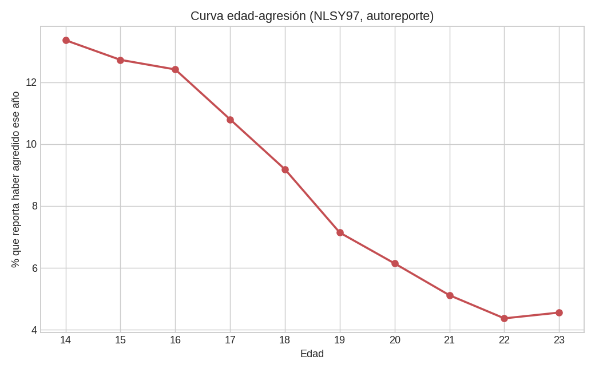
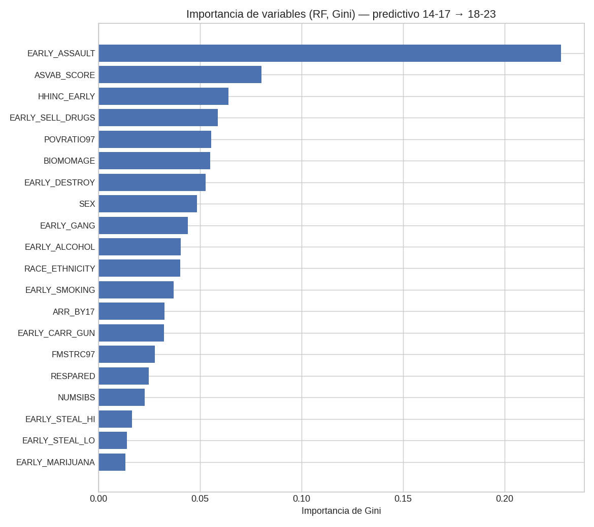
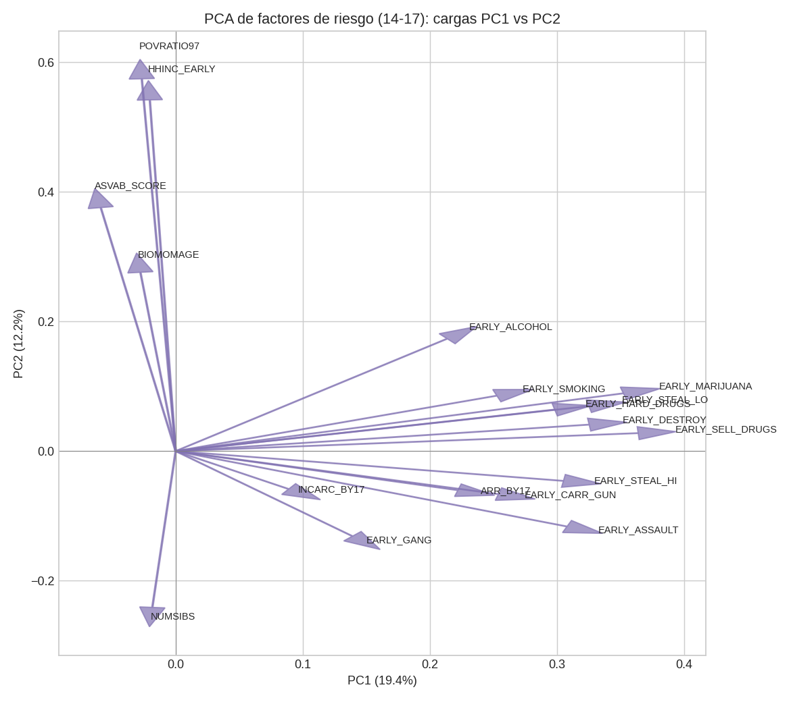
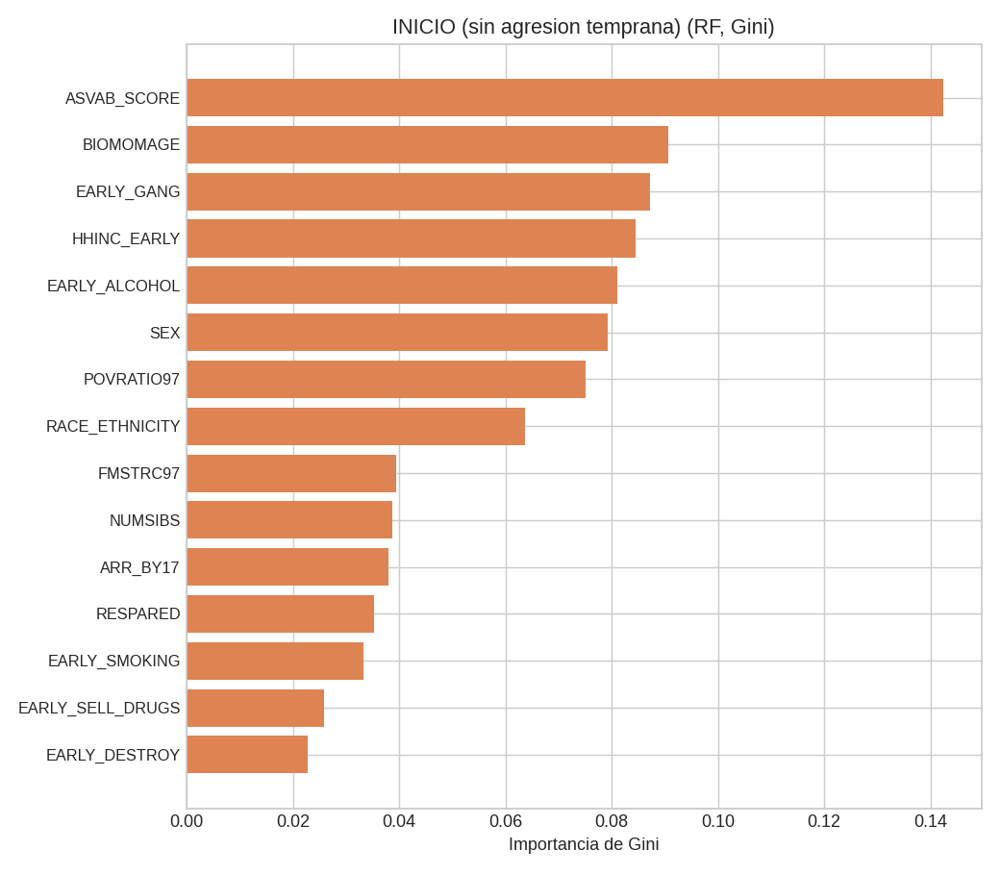
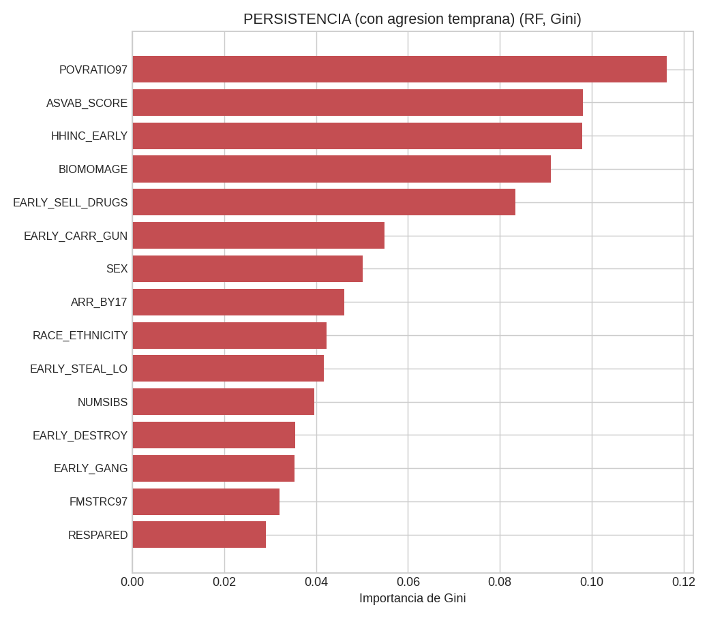

# Mérito intelectual del proyecto

La violencia juvenil nos parece un problema importante de política pública porque no termina en el momento del acto violento. Afecta a las víctimas, a las familias, a las escuelas y también a las oportunidades futuras de quienes la ejercen. Varios estudios han encontrado que las conductas antisociales en edades tempranas pueden repetirse más adelante, aunque esto no significa que todas las personas que agreden en la adolescencia necesariamente lo hagan en la adultez [@moffitt1993; @sampsonlaub1993]. Desde ahí surge una pregunta que nos interesa como estudiantes de Ciencia de Datos: qué tanto se puede anticipar la agresión física posterior usando información observada antes de que ocurra.

Esta pregunta se conecta con dos explicaciones clásicas. @gottfredsonhirschi1990 argumentan que ciertas conductas problemáticas comparten un origen común asociado con bajo autocontrol, mientras que @hirschi1969 enfatiza la importancia de los vínculos sociales con la familia, la escuela y otras instituciones. En términos de política pública, la diferencia no es menor. Si la violencia posterior se explica sobre todo por rasgos estables, entonces la conducta previa debería pesar mucho en cualquier predicción. Si, en cambio, el entorno social modifica las trayectorias, entonces las condiciones familiares, escolares y económicas deberían ayudar a identificar momentos de intervención.

Nuestro trabajo parte de dos preguntas. Primero, queremos saber qué variables de la adolescencia predicen mejor la agresión física entre los 18 y los 23 años. Segundo, queremos distinguir si los factores asociados con empezar a agredir son los mismos que se relacionan con seguir agrediendo. Esta separación es central para la discusión pública, porque no es lo mismo diseñar programas universales de prevención que decidir a quién se le da seguimiento después de un primer episodio de violencia.

La contribución que buscamos hacer es combinar una pregunta sustantiva de política pública con herramientas predictivas. Usamos modelos de *random forest* e importancia de variables sobre una cohorte nacional de Estados Unidos, en lugar de trabajar con una muestra clínica o local. Además, usamos análisis de componentes principales para describir si las distintas conductas de riesgo se agrupan en una dimensión común. Nuestro análisis retoma la literatura sobre predictores de violencia juvenil de @lipseyderzon1998 y la discusión de @nagin1991 sobre si la conducta pasada predice la conducta futura porque las personas son distintas desde el inicio o porque una conducta previa cambia la trayectoria posterior. Todo el análisis se apoya en fuentes académicas y en datos documentados por el Bureau of Justice Statistics y el ICPSR [@icpsr34562].

# Variables y datos

Usamos el estudio ICPSR 34562, preparado por el Bureau of Justice Statistics con base en la Encuesta Nacional Longitudinal de la Juventud de 1997, conocida como NLSY97 [@icpsr34562]. Esta encuesta siguió a 8,984 personas nacidas en Estados Unidos entre 1980 y 1984. Para nuestro objetivo, la ventaja principal de la base es que permite observar información de las mismas personas durante la adolescencia. Después podemos comparar esa información con lo que reportaron al entrar a la adultez joven. En la base, varias preguntas no están guardadas por año de entrevista, sino por la edad de la persona cuando respondió. Por ejemplo, una columna puede resumir qué ocurrió a los 14 años y otra qué ocurrió a los 15. Esto hace que algunas edades tengan más información que otras, porque no todos los entrevistados tenían la misma edad cuando empezó el levantamiento en 1997.

La variable dependiente principal toma el valor de uno si la persona reportó haber agredido físicamente a alguien con intención de hacerle daño en al menos una ocasión entre los 18 y los 23 años, y toma el valor de cero en caso contrario. La encuesta también tiene información para algunas edades posteriores, pero decidimos no usar los datos de los 24 y 25 años porque en esa parte aparecen observaciones de una submuestra de personas en prisión. Si las incluyéramos, la proporción de agresión podría verse más alta de lo que realmente es para la cohorte completa. De las 8,984 personas en la muestra original, 8,609 tienen al menos una respuesta válida para esta variable. Dentro de ese grupo, 16.9 por ciento reportó haber agredido a alguien entre los 18 y los 23 años.

Todas las variables explicativas fueron medidas antes del periodo que queremos predecir. Algunas vienen del levantamiento inicial de 1997 y otras resumen conductas observadas entre los 14 y los 17 años. Esta decisión es importante porque evita usar información contemporánea al resultado. En la parte de contexto incluimos sexo, raza o etnicidad, estructura familiar, escolaridad y empleo de los padres, número de hermanos, razón entre ingreso del hogar y línea de pobreza, edad de la madre al nacimiento y puntaje ASVAB. El ASVAB es una prueba de aptitudes usada en Estados Unidos que mide habilidades en áreas como razonamiento, matemáticas y comprensión verbal, por lo que la usamos como una aproximación a habilidades cognitivas. En la parte de conductas adolescentes incluimos agresión, destrucción de propiedad, robo, venta de drogas, portación de arma, pertenencia a pandillas, consumo de alcohol, tabaco, marihuana y drogas duras, además de arresto o encarcelamiento antes de los 17 años. La Figura 1 del anexo muestra la relación entre edad y agresión en estos datos, con un aumento durante la adolescencia y una caída posterior, como plantea la literatura sobre edad y crimen [@hirschigottfredson1983].

Como suele ocurrir en encuestas longitudinales, la base tiene datos faltantes. Esto se debe tanto a la estructura por edad del archivo como a la pérdida de seguimiento de algunas personas. Además, la NLSY97 usa códigos especiales para distinguir respuestas como no sabe, no contestó, entrevista no realizada o pregunta no aplicable. En nuestro procesamiento tratamos esos códigos como valores faltantes, porque no representan una respuesta sustantiva. Para poder estimar los modelos con una matriz completa, imputamos las variables explicativas con su mediana. Esta decisión permite conservar más observaciones, pero también tiene límites. Algunas variables, como el ingreso del hogar o el empleo del padre, tienen menor cobertura que otras, por lo que su importancia debe leerse con cautela.

# Diseño empírico general

El diseño empírico es predictivo, no causal. Por eso, no interpretamos los resultados como efectos de una variable sobre la violencia, sino como evidencia sobre qué información ayuda más a anticiparla. La parte central del trabajo consiste en comparar tres modelos. Los tres usan información observada antes de los 18 años para predecir si la persona reportó agresión física entre los 18 y los 23 años. La diferencia está en la muestra que usa cada uno y en la pregunta concreta que responde.

El primer modelo es el modelo global. Incluye a todas las personas con información suficiente y usa todas las variables medidas antes de la adultez joven. Este modelo responde una pregunta general: qué variables de la adolescencia predicen mejor la agresión física posterior. El segundo modelo es el modelo de inicio. En este caso dejamos solamente a quienes no habían reportado agresión física entre los 14 y los 17 años. Lo usamos para estudiar qué variables predicen que una persona empiece a reportar agresión después de la adolescencia. El tercer modelo es el modelo de persistencia. Aquí dejamos solamente a quienes sí habían reportado agresión física entre los 14 y los 17 años. Lo usamos para estudiar qué variables predicen que esa conducta continúe entre los 18 y los 23 años. En los modelos de inicio y persistencia quitamos la agresión temprana como predictor, porque esa variable ya se usa para definir a qué grupo pertenece cada persona.

Escogimos esta separación porque creemos que no basta con saber si la agresión pasada predice la agresión futura. También importa saber si las variables que anticipan el primer reporte de agresión son las mismas que anticipan la continuidad de esa conducta. Esta distinción es útil para política pública. Si el inicio se puede anticipar con variables del entorno, entonces tiene sentido pensar en prevención temprana. Si la persistencia no se puede predecir bien, entonces habría que tener cuidado con modelos que pretendan clasificar a jóvenes como casos de alto riesgo.

Estimamos los modelos con *random forest*, un método de aprendizaje de máquina que combina muchos árboles de decisión [@breiman2001]. La predicción final se obtiene promediando las predicciones de todos los árboles. En términos formales, la probabilidad estimada para una persona con características $x$ es $\hat{p}(x) = \frac{1}{B} \sum_{b=1}^{B} \hat{p}_b(x)$, donde $B$ es el número de árboles y $\hat{p}_b(x)$ es la proporción de casos violentos en la hoja a la que llega esa persona en el árbol $b$. Usamos este método porque permite trabajar con muchas variables al mismo tiempo y porque nos da medidas de importancia de variables, que son centrales para responder nuestra pregunta.

Para medir la importancia de cada variable usamos dos criterios. El primero es la reducción de impureza de Gini. En cada árbol, el algoritmo separa los datos buscando grupos más homogéneos, y el índice de Gini se define como $G = 1 - \sum_{k} p_k^2$, donde $p_k$ representa la proporción de la clase $k$ dentro de un nodo. Una variable es más importante si ayuda más a mejorar esas separaciones. Como esta medida puede favorecer variables con muchos valores posibles [@strobl2007], también usamos importancia por permutación. La idea es que, si una variable importa, mezclar sus valores al azar debería empeorar la predicción. La expresamos como $PI_j = A - \frac{1}{R} \sum_{r=1}^{R} A_{\pi_j^{(r)}}$, donde $A$ es el área bajo la curva ROC original y $A_{\pi_j^{(r)}}$ es el área obtenida después de permutar la variable $j$ en la repetición $r$.

Para evaluar el desempeño, separamos 20 por ciento de los datos como muestra de prueba y entrenamos el modelo con el 80 por ciento restante. Además, usamos validación cruzada de cinco pliegues. En ambos casos reportamos el área bajo la curva ROC, que puede interpretarse como la probabilidad de que el modelo asigne un riesgo mayor a una persona que sí reportó agresión que a una persona que no la reportó. Como la agresión física entre los 18 y los 23 años es un evento minoritario, usamos pesos inversos a la frecuencia de cada clase para que el modelo no aprenda a favorecer sistemáticamente la categoría más común. Por último, usamos análisis de componentes principales como ejercicio descriptivo para ver si las conductas de riesgo se mueven juntas. No usamos este ejercicio para hacer predicción individual, sino para interpretar si existe una dimensión común detrás de las conductas adolescentes.

# Resultados

El primer resultado es que la agresión temprana concentra gran parte de la información predictiva. Como se observa en la Tabla 2 y en la Figura 2 del anexo, es la variable más importante tanto por reducción de impureza como por permutación. La diferencia descriptiva también es clara: entre quienes reportaron agresión entre los 14 y los 17 años, 37.4 por ciento volvió a reportarla entre los 18 y los 23 años. Entre quienes no habían reportado agresión temprana, la proporción fue de 10.6 por ciento. El modelo global obtuvo un área bajo la curva de 0.80 en la muestra de prueba y de 0.76 en validación cruzada. Después de la agresión temprana aparecen, con menor peso, habilidad cognitiva, ingreso del hogar, venta temprana de drogas, sexo y pertenencia a pandillas.

El análisis de componentes principales aporta una lectura complementaria. La Figura 3 muestra que el primer componente explica cerca de 20 por ciento de la varianza y carga positivamente sobre distintas conductas antisociales y de riesgo, como vender drogas, consumir marihuana, destruir propiedad, robar, agredir o portar un arma. Ese componente se correlaciona en 0.30 con la agresión adulta. Para nosotros, esto sugiere que las conductas adolescentes no deben leerse como hechos completamente aislados. Más bien, parecen formar un patrón común, consistente con la idea de conducta problema de @jessor1977 y con la teoría general del crimen de @gottfredsonhirschi1990.

El resultado más importante aparece al separar inicio y persistencia. Entre las 6,568 personas que no habían agredido entre los 14 y los 17 años, el modelo de inicio obtuvo un área bajo la curva de 0.71. Las variables más relevantes combinan características individuales, entorno y conductas tempranas de riesgo: habilidad cognitiva, edad de la madre al nacimiento, pertenencia a pandillas, ingreso del hogar, consumo de alcohol, sexo y razón de pobreza. En cambio, entre las 2,029 personas que ya habían reportado agresión temprana, el modelo de persistencia tuvo un área bajo la curva de 0.58 en la muestra de prueba. Esto significa que, con las variables disponibles, distinguir quién continuará agrediendo es mucho más difícil que distinguir quién podría iniciar.

En el modelo de persistencia, las señales que aparecen son más débiles y menos estables. La razón de pobreza, la habilidad cognitiva, el ingreso del hogar, la edad de la madre, la venta temprana de drogas, la portación de arma y el arresto antes de los 17 años aparecen entre las variables con mayor importancia de Gini. Sin embargo, el desempeño general del modelo nos obliga a ser cuidadosos: esas variables no bastan para generar una predicción fuerte. Este punto es relevante para política pública, porque muestra que haber observado violencia temprana no permite clasificar con precisión quién seguirá una trayectoria violenta.

Los contrastes bivariados de la Tabla 4 son consistentes con la literatura. La tasa de agresión adulta fue mayor entre hombres que entre mujeres, 21.7 frente a 11.9 por ciento. También fue mayor en personas que crecieron en estructuras familiares distintas a dos padres biológicos, lo que coincide con la evidencia revisada por @loeber1986 sobre factores familiares. Aun así, en los modelos predictivos algunas de estas variables quedan por debajo de conductas tempranas más directas. Nuestra interpretación es que parte de la relación entre contexto familiar y violencia posterior puede pasar por lo que la persona vive y hace durante la adolescencia [@sampsonlaub1993].

# Conclusión

Nuestro principal hallazgo es que la agresión temprana es el predictor más fuerte de la agresión física en la adultez joven. Dicho de forma simple, quienes reportaron haber agredido a alguien entre los 14 y los 17 años tuvieron una probabilidad mucho más alta de reportarlo otra vez entre los 18 y los 23. Este resultado coincide con estudios previos sobre la continuidad de conductas antisociales [@moffitt1993; @farrington2003]. Sin embargo, lo más importante del trabajo está en separar el inicio de la persistencia. El inicio de la agresión se puede anticipar con un desempeño razonable a partir de variables observadas en la adolescencia, mientras que la persistencia es mucho más difícil de predecir con la información disponible.

La implicación de política pública es directa. Parece más útil invertir en prevención temprana que intentar señalar con mucha precisión qué jóvenes seguirán siendo violentos. Si variables como consumo temprano de alcohol, pertenencia a pandillas, habilidad cognitiva, ingreso del hogar y pobreza ayudan a anticipar el inicio, entonces tiene sentido fortalecer intervenciones en edades tempranas y en contextos vulnerables. Esta lectura es consistente con la evidencia de @heckman2006 sobre la importancia de invertir temprano en poblaciones desfavorecidas. Al mismo tiempo, el bajo desempeño del modelo de persistencia nos hace pensar que las herramientas de predicción individual deben usarse con cuidado, porque una predicción débil puede producir errores con consecuencias serias.

El trabajo también tiene límites. La agresión está medida por autorreporte y no distingue entre distintos niveles de gravedad. Además, algunas variables tienen cobertura parcial y fueron imputadas con la mediana, lo cual puede reducir o distorsionar su importancia. Por último, la cohorte corresponde a jóvenes nacidos en Estados Unidos entre 1980 y 1984, por lo que cualquier lectura para México debe hacerse con cuidado. Aun con estas limitaciones, el resultado central es claro: prevenir el inicio de la violencia parece una meta más alcanzable que predecir quién continuará agrediendo después.

# Anexo: tablas y figuras {.appendix}

| Modelo | Muestra | Prevalencia | AUC prueba | AUC validación cruzada |
|:-------|:-------:|:-----------:|:----------:|:----------------------:|
| Global (14-17 a 18-23) | 8,609 | 16.9 % | 0.80 | 0.76 (±0.03) |
| Inicio (sin agresión temprana) | 6,568 | 10.6 % | 0.71 | 0.70 (±0.04) |
| Persistencia (con agresión temprana) | 2,029 | 37.4 % | 0.58 | 0.62 (±0.04) |

: Desempeño de los tres modelos de *random forest*. {#tbl-desempeno}

\newpage

| Variable | Importancia de Gini | Importancia por permutación |
|:---------|:-------------------:|:---------------------------:|
| Agresión temprana (14-17) | 0.228 | 0.079 |
| Habilidad cognitiva (ASVAB) | 0.080 | 0.007 |
| Ingreso del hogar (14-17) | 0.064 | bajo |
| Venta de drogas temprana | 0.059 | 0.003 |
| Razón de pobreza (1997) | 0.055 | bajo |
| Edad de la madre al nacer | 0.055 | 0.005 |
| Destrucción de propiedad temprana | 0.053 | 0.003 |
| Sexo (hombre) | 0.049 | 0.014 |
| Pandilla temprana | 0.044 | 0.010 |
| Alcohol temprano | 0.041 | 0.014 |

: Importancia de variables en el modelo global. {#tbl-global}

\newpage

| Modelo de inicio | Importancia | | Modelo de persistencia | Importancia |
|:-----------------|:-----------:|:-:|:-----------------------|:-----------:|
| Habilidad cognitiva | 0.142 | | Razón de pobreza | 0.116 |
| Edad de la madre | 0.091 | | Habilidad cognitiva | 0.098 |
| Pandilla temprana | 0.087 | | Ingreso del hogar | 0.098 |
| Ingreso del hogar | 0.084 | | Edad de la madre | 0.091 |
| Alcohol temprano | 0.081 | | Venta de drogas temprana | 0.084 |
| Sexo (hombre) | 0.079 | | Portación de arma temprana | 0.055 |
| Razón de pobreza | 0.075 | | Arresto antes de los 17 | 0.046 |

: Importancia de Gini en los modelos de inicio y persistencia. {#tbl-inicio-persistencia}

\newpage

| Grupo | Categoría | Tasa de agresión 18-23 |
|:------|:----------|:----------------------:|
| Sexo | Hombre | 21.7 % |
| Sexo | Mujer | 11.9 % |
| Raza o etnicidad | Afroamericano | 21.5 % |
| Raza o etnicidad | Hispano | 16.8 % |
| Raza o etnicidad | Blanco u otro | 14.5 % |
| Estructura familiar | Dos padres biológicos | 13.5 % |
| Estructura familiar | Un solo padre | 18.4 % |
| Estructura familiar | Otra estructura | 22.9 % |

: Tasas de agresión adulta por subgrupo. {#tbl-bivariado}

\newpage

{#fig-edad width=85%}

\newpage

{#fig-gini width=85%}

\newpage

{#fig-pca width=85%}

\newpage

{#fig-inicio width=80%}

\newpage

{#fig-persistencia width=80%}

# Referencias {.unnumbered}

::: {#refs}
:::
