# Mérito intelectual del proyecto

La pregunta central de este trabajo es qué variables medidas antes de la adultez ayudan a anticipar si una persona reportará una agresión física entre los 18 y los 23 años. El objetivo no es estimar un efecto causal de una conducta específica, sino ordenar la información disponible por su capacidad para predecir una trayectoria posterior. La pregunta tiene relevancia de política pública porque la prevención de violencia necesita decidir cuándo y con qué información identificar riesgos. Si la información demográfica o familiar fuera suficiente, bastaría con diagnósticos tempranos y relativamente estables. Si, en cambio, la mayor señal aparece en conductas observables durante la adolescencia, los años inmediatamente anteriores a la adultez tendrían más valor para identificar casos con riesgo alto.

El trabajo usa únicamente el archivo ICPSR 34562, un subconjunto del National Longitudinal Survey of Youth 1997 preparado para estudiar reincidencia y trayectorias relacionadas con el sistema de justicia [@icpsr34562]. La base sigue a jóvenes nacidos en Estados Unidos entre 1980 y 1984 y contiene variables organizadas por edad. Esta estructura permite separar temporalmente los predictores y el resultado: los predictores se construyen con información de los 14 a los 17 años, mientras que la variable dependiente se define con información de los 18 a los 23 años. Esa separación es el elemento más importante del diseño, porque evita que el modelo use como predictor información contemporánea o posterior al resultado.

La contribución empírica del análisis es comparar dos lecturas de la misma pregunta. La primera es un modelo de probabilidad lineal jerárquico, que permite interpretar coeficientes como cambios en probabilidad y evaluar cuánto aumenta la varianza explicada cuando se agrega cada bloque de variables. La segunda es un random forest, usado como herramienta predictiva no lineal [@breiman2001]. Para que el random forest sea interpretable, el análisis calcula importancia por permutación de bloques, siguiendo la lógica documentada en el propio script de análisis: si romper la información conjunta de un bloque deteriora el AUC, ese bloque contiene señal predictiva relevante [@strobl2008; @molnar2022]. La comparación es útil porque ambos modelos usan la misma muestra analítica y los mismos bloques.

# Variables y datos

La fuente de datos es `DS0001/34562-0001-Data.dta`, del estudio ICPSR 34562. El archivo original tiene 8,984 respondentes. En el análisis se conservan primero las personas con al menos una observación válida de agresión adulta entre los 18 y los 23 años. Después se aplica eliminación por lista sobre la variable dependiente y los 26 predictores usados en los modelos. La muestra analítica final tiene 3,737 personas, de las cuales 535 reportaron agresión adulta. Por tanto, la prevalencia de la variable dependiente en la muestra usada para los modelos es 14.3 por ciento.

La variable dependiente es `ASSAULT_ADULT`, que toma el valor de uno si la persona reportó haber cometido una agresión en al menos un año de edad entre los 18 y los 23 años, y cero si tiene información válida en ese rango y no reportó agresión. Esta definición evita usar `EVER_ASSAULT` de toda la ventana disponible, porque esa alternativa mezclaría edades adolescentes con edades adultas y crearía filtración temporal entre predictores y resultado.

Los predictores se agrupan en cinco bloques. El bloque demográfico incluye sexo, raza o etnicidad, edad de la madre biológica al nacimiento y número de hermanos. El bloque de familia y nivel socioeconómico incluye estructura familiar en 1997, educación parental y razón ingreso a línea de pobreza en 1997. El bloque cognitivo usa el puntaje `ASVAB_SCORE`. El bloque de conducta pasada cuenta, entre los 14 y los 17 años, en cuántos años la persona reportó destrucción de propiedad, robo menor a 50 dólares, robo mayor a 50 dólares, otro delito contra propiedad, presencia o contacto con pandillas, portación de arma y huida del hogar. El bloque de justicia y sustancias cuenta consumo de tabaco, alcohol, marihuana y drogas duras en la misma ventana, además de un indicador de arresto antes de cumplir 18 años.

Las variables binarias de la base se limpian convirtiendo respuestas afirmativas y negativas a uno y cero. Las categorías de no entrevista, rechazo, no sabe y valores negativos se tratan como faltantes. Las conductas por edad se convierten en conteos de años válidos entre cero y cuatro. Esta decisión conserva la intensidad temporal de la conducta sin usar información posterior a los 17 años.

# Diseño empírico general

El diseño es predictivo y asociativo. No se interpreta ningún coeficiente como efecto causal, porque el análisis no identifica una fuente exógena de variación. La temporalidad sí permite una lectura predictiva clara: toda la información explicativa ocurre antes de la ventana de agresión adulta. En este sentido, los modelos responden qué tanto se puede anticipar el resultado con información disponible antes de los 18 años.

El primer componente es una secuencia de modelos de probabilidad lineal. Para cada persona \(i\), el modelo general es
\[
Y_i = \alpha_m + \sum_{b=1}^{m} X_i^{(b)}\beta^{(b)} + \varepsilon_i,
\]
donde \(Y_i\) es `ASSAULT_ADULT`, \(X_i^{(b)}\) es el vector de predictores del bloque \(b\), \(\beta^{(b)}\) contiene los coeficientes de ese bloque y \(m\) indica cuántos bloques se han incorporado. El modelo \(M1\) incluye sólo variables demográficas. \(M2\) agrega familia y nivel socioeconómico. \(M3\) agrega ASVAB. \(M4\) agrega conducta pasada. \(M5\), que es el modelo preferido del análisis lineal, agrega justicia y sustancias. También se estima \(M6\), que añade dos interacciones entre sexo y raza o etnicidad, pero ese modelo se usa como extensión porque las interacciones no mejoran el ajuste de manera convencional al cinco por ciento.

El modelo de probabilidad lineal se estima por mínimos cuadrados ordinarios con errores estándar robustos HC1. Esta corrección es necesaria porque la variable dependiente es binaria y el diagnóstico de Breusch-Pagan del modelo final rechaza homocedasticidad. Para evaluar cada bloque se usa una prueba F incremental entre modelos anidados. El estadístico compara la reducción en suma de cuadrados residuales al agregar el nuevo bloque contra el error residual del modelo más amplio. Además, se reportan \(R^2\), \(R^2\) ajustada, AIC y BIC.

El segundo componente es un random forest de clasificación entrenado sobre los mismos 26 predictores. La muestra se divide en 85 por ciento de entrenamiento y 15 por ciento de prueba, con estratificación por la variable dependiente. El modelo usa 500 árboles, `max_features = sqrt`, mínimo de 10 observaciones por hoja, pesos balanceados por clase y estimación out-of-bag. La métrica principal es el AUC en la muestra de prueba, porque evalúa la capacidad de ordenar casos positivos por encima de negativos sin depender de un umbral específico.

La importancia por permutación de bloques se calcula sobre el conjunto de prueba. Para cada bloque \(B_k\), el análisis permuta simultáneamente todas sus columnas, predice de nuevo y calcula la caída en AUC:
\[
BPI(B_k) = AUC(f, D) - AUC(f, D^{perm}_{B_k}).
\]
El procedimiento se repite 100 veces por bloque. Se reporta la media de la caída, su desviación estándar y el intervalo empírico de 95 por ciento. Esta medida se interpreta como cuánto pierde el modelo cuando se destruye la información conjunta de ese bloque, manteniendo el resto de los predictores intacto.

# Resultados

La muestra analítica tiene una prevalencia de agresión adulta de 14.3 por ciento. En los descriptivos simples, los hombres presentan una prevalencia de 19.3 por ciento y las mujeres de 9.2 por ciento. Por raza o etnicidad, la prevalencia es 20.4 por ciento para personas Black, 14.7 por ciento para personas Hispanic, 16.1 por ciento para personas Mixed y 11.9 por ciento para la categoría Non-Black/Non-Hispanic. Por educación de los padres, la prevalencia va de 20.1 por ciento entre quienes tienen padres con menos de preparatoria a 10.7 por ciento entre quienes tienen padres con licenciatura o más. Estos contrastes son descriptivos y no deben leerse como efectos netos.

Los modelos jerárquicos muestran que el ajuste aumenta de manera desigual entre bloques. El modelo demográfico tiene una \(R^2\) ajustada de 0.034. Agregar familia y nivel socioeconómico la eleva a 0.040, y agregar ASVAB la deja en 0.041. El salto principal ocurre al incorporar conducta pasada: la \(R^2\) ajustada sube a 0.096 y el incremento de \(R^2\) no ajustada es 0.056. El bloque final de justicia y sustancias aumenta la \(R^2\) ajustada a 0.102. La extensión con interacciones sexo por raza llega a 0.103, pero la prueba incremental tiene \(p = 0.084\), por lo que el modelo preferido sigue siendo \(M5\).

En el modelo \(M5\), varios coeficientes tienen una interpretación sustantiva directa. Ser mujer se asocia con una probabilidad 7.2 puntos porcentuales menor de reportar agresión adulta, manteniendo constantes los demás predictores del modelo. La categoría `RACE_BLACK` se asocia con una probabilidad 7.0 puntos mayor respecto a la categoría de referencia. Cada año adicional en que la persona reportó destrucción de propiedad entre los 14 y los 17 años se asocia con 3.6 puntos porcentuales más de probabilidad. Presencia o contacto con pandillas se asocia con 3.8 puntos por año, portación de arma con 4.7 puntos por año y haber huido del hogar con 5.9 puntos por año. Haber sido arrestado antes de los 18 años se asocia con 7.4 puntos porcentuales adicionales.

No todas las variables agregan señal una vez que entran los bloques de conducta y justicia. ASVAB es significativo cuando se agrega como tercer bloque, pero su coeficiente deja de ser distinguible de cero en \(M5\). Algo parecido ocurre con algunas variables familiares: el bloque completo aporta al ajuste, pero varios coeficientes individuales pierden precisión al controlar por conductas adolescentes. Esto sugiere que el ordenamiento por bloques es más informativo que una lectura aislada de cada coeficiente.

La validación fuera de muestra del modelo lineal \(M5\) muestra una capacidad predictiva moderada. En entrenamiento, el AUC es 0.764 y el \(R^2\) es 0.119. En prueba, con 561 personas, el AUC baja a 0.682 y el \(R^2\) a 0.036. La precisión con umbral de 0.5 es 85.4 por ciento en prueba, pero esta cifra debe interpretarse con cuidado porque el resultado positivo es poco frecuente. Por eso el AUC es más útil como medida principal.

El random forest mejora la discriminación fuera de muestra. Su AUC de prueba es 0.727, con AUC out-of-bag de 0.747 y AUC de entrenamiento de 0.928. La diferencia entre entrenamiento y prueba indica sobreajuste residual, aunque la métrica de prueba sigue por encima del modelo lineal. La importancia por permutación de bloques confirma el resultado central del análisis lineal. Permutar el bloque de conducta pasada reduce el AUC en 0.088 en promedio. El bloque demográfico reduce el AUC en 0.058 y el bloque de justicia y sustancias en 0.030. Familia y nivel socioeconómico tiene una caída media de 0.016, mientras que el bloque cognitivo tiene una caída cercana a cero y un intervalo que cruza cero.

La lectura conjunta es estable. En los dos métodos, la conducta observada entre los 14 y los 17 años concentra la mayor parte de la señal predictiva. Las variables demográficas también importan, sobre todo sexo y raza o etnicidad, pero su interpretación de política pública es distinta porque no son variables de intervención directa. El bloque de justicia y sustancias aporta menos que conducta pasada, pero contiene variables que pueden ser observables por instituciones antes de la adultez. El resultado no dice que intervenir sobre esas conductas produciría mecánicamente una reducción equivalente de agresión adulta. Sí dice que, dentro de estos datos, esas conductas son los marcadores más útiles para anticipar el resultado.

# Conclusión

El hallazgo principal es que la información conductual de la adolescencia es el predictor más fuerte de agresión física reportada en la adultez joven. Esta conclusión aparece tanto en el modelo de probabilidad lineal jerárquico como en el random forest con importancia por permutación de bloques. La robustez entre métodos importa porque el primer modelo es fácil de interpretar, mientras que el segundo permite relaciones no lineales e interacciones sin imponerlas de forma explícita.

Para política pública, el resultado apunta a la utilidad de sistemas de prevención que observen conductas concretas durante la adolescencia. En particular, presencia o contacto con pandillas, portación de arma, huida del hogar, destrucción de propiedad, consumo de marihuana y arresto temprano aparecen como señales relevantes dentro del modelo final. La política pública no debería leer estos resultados como una justificación para castigos automáticos o perfiles rígidos. Una interpretación más prudente es que esos eventos pueden servir para activar apoyos, seguimiento y programas preventivos antes de que la trayectoria llegue a la adultez.

El trabajo también muestra límites importantes. El resultado depende de autorreportes de agresión, por lo que puede haber subregistro o diferencias en disposición a responder. La muestra analítica se reduce a personas con información completa en todas las variables, lo cual puede afectar la representatividad. Además, el diseño no identifica causalidad. Aun así, la separación temporal entre predictores y resultado, el uso de la misma muestra para ambos métodos y la comparación por bloques hacen que el ordenamiento predictivo sea claro: las variables más próximas a la conducta adolescente explican más que los bloques distales.

\clearpage

# Anexo: tablas y figuras {.appendix}

| Variable | Media | Desv. est. | Mín. | Máx. |
|:--|--:|--:|--:|--:|
| Agresión adulta | 0.143 | 0.350 | 0 | 1 |
| Mujer | 0.493 | 0.500 | 0 | 1 |
| Black | 0.220 | 0.414 | 0 | 1 |
| Hispanic | 0.182 | 0.386 | 0 | 1 |
| Edad de la madre biológica | 25.697 | 5.267 | 12 | 52 |
| Número de hermanos | 1.556 | 1.190 | 0 | 9 |
| Razón ingreso a pobreza 1997 | 2.976 | 2.709 | 0 | 16.27 |
| ASVAB | 47.976 | 29.107 | 0 | 100 |
| Presencia o contacto con pandillas, conteo 14-17 | 0.560 | 0.678 | 0 | 4 |
| Portó arma, conteo 14-17 | 0.161 | 0.468 | 0 | 4 |
| Arresto antes de 18 | 0.134 | 0.340 | 0 | 1 |

: Estadísticos descriptivos de variables seleccionadas en la muestra analítica. \(n = 3{,}737\). {#tbl-desc}

\newpage

| Modelo | Bloque agregado | Predictores | \(R^2\) ajustada | AIC | BIC |
|:--|:--|--:|--:|--:|--:|
| M1 | Demográfico | 6 | 0.034 | 2641.9 | 2685.5 |
| M2 | Familia y SES | 13 | 0.040 | 2625.6 | 2712.8 |
| M3 | Cognitivo | 14 | 0.041 | 2623.5 | 2716.9 |
| M4 | Conducta pasada | 21 | 0.096 | 2411.2 | 2548.1 |
| M5 | Justicia y sustancias | 26 | 0.102 | 2389.4 | 2557.5 |
| M6 | Interacción sexo por raza | 28 | 0.103 | 2388.4 | 2568.9 |

: Ajuste de modelos de probabilidad lineal jerárquicos. Todos usan la misma muestra analítica. {#tbl-fit}

\newpage

| Transición | Bloque evaluado | \(\Delta R^2\) | \(F\) | gl | \(p\) |
|:--|:--|--:|--:|:--:|--:|
| M1 a M2 | Familia y SES | 0.0078 | 4.33 | 7, 3723 | 0.000088 |
| M2 a M3 | Cognitivo | 0.0011 | 4.13 | 1, 3722 | 0.042 |
| M3 a M4 | Conducta pasada | 0.0561 | 33.13 | 7, 3715 | < 0.001 |
| M4 a M5 | Justicia y sustancias | 0.0076 | 6.34 | 5, 3710 | 0.000007 |
| M5 a M6 | Interacción sexo por raza | 0.0012 | 2.48 | 2, 3708 | 0.084 |

: Pruebas F incrementales entre modelos anidados. {#tbl-anova}

\newpage

| Variable | Coef. | EE HC1 | \(p\) | IC 95 por ciento |
|:--|--:|--:|--:|:--|
| Mujer | -0.0716 | 0.0115 | < 0.001 | [-0.0941, -0.0491] |
| Black | 0.0701 | 0.0174 | < 0.001 | [0.0360, 0.1042] |
| Número de hermanos | -0.0100 | 0.0048 | 0.036 | [-0.0194, -0.0007] |
| Preparatoria parental | -0.0450 | 0.0203 | 0.027 | [-0.0847, -0.0052] |
| Destrucción de propiedad | 0.0361 | 0.0109 | 0.001 | [0.0147, 0.0575] |
| Pandilla | 0.0377 | 0.0092 | < 0.001 | [0.0196, 0.0558] |
| Portó arma | 0.0470 | 0.0163 | 0.004 | [0.0150, 0.0790] |
| Huyó del hogar | 0.0592 | 0.0174 | 0.001 | [0.0251, 0.0934] |
| Marihuana | 0.0224 | 0.0103 | 0.029 | [0.0023, 0.0425] |
| Arresto antes de 18 | 0.0738 | 0.0233 | 0.002 | [0.0282, 0.1194] |

: Coeficientes seleccionados del modelo \(M5\). Las conductas son conteos de años entre los 14 y los 17 años, salvo arresto, que es binario. {#tbl-coefs}

\newpage

| Métrica | Entrenamiento M5 | Prueba M5 | Random forest |
|:--|--:|--:|--:|
| \(n\) | 3,176 | 561 | 561 en prueba |
| AUC | 0.764 | 0.682 | 0.727 |
| \(R^2\) | 0.119 | 0.036 | No aplica |
| RMSE | 0.329 | 0.343 | No aplica |
| Accuracy con umbral 0.5 | 0.858 | 0.854 | No reportada |

: Validación fuera de muestra. El random forest reporta AUC en el conjunto de prueba. {#tbl-validation}

\newpage

| Bloque | Caída media en AUC | Desv. est. | IC 95 por ciento |
|:--|--:|--:|:--|
| Conducta pasada | 0.0884 | 0.0216 | [0.0437, 0.1275] |
| Demográfico | 0.0577 | 0.0148 | [0.0289, 0.0861] |
| Justicia y sustancias | 0.0302 | 0.0156 | [0.0013, 0.0589] |
| Familia y SES | 0.0161 | 0.0079 | [0.0009, 0.0303] |
| Cognitivo | 0.0026 | 0.0071 | [-0.0099, 0.0156] |

: Importancia por permutación de bloques en el random forest. El AUC base de prueba es 0.7271. {#tbl-bpi}

\newpage

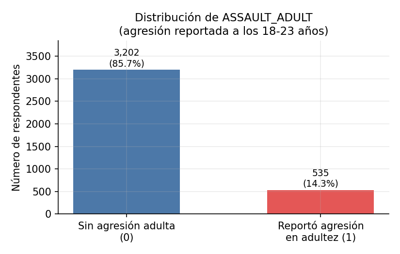{#fig-target width=75%}

\newpage

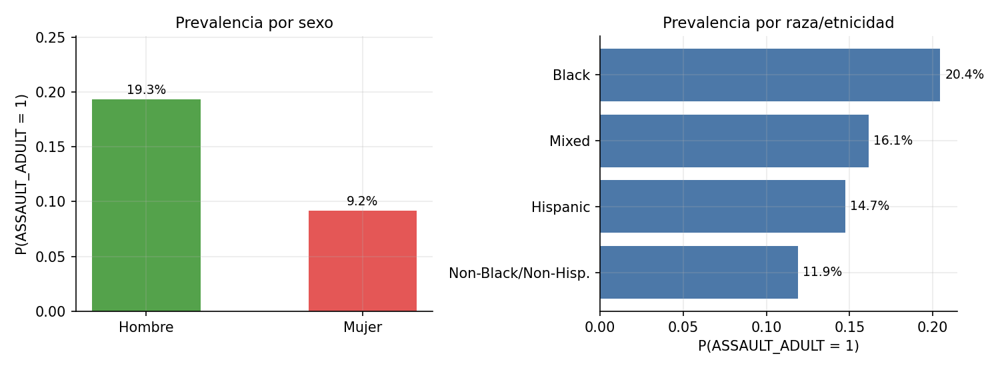{#fig-sex-race width=90%}

\newpage

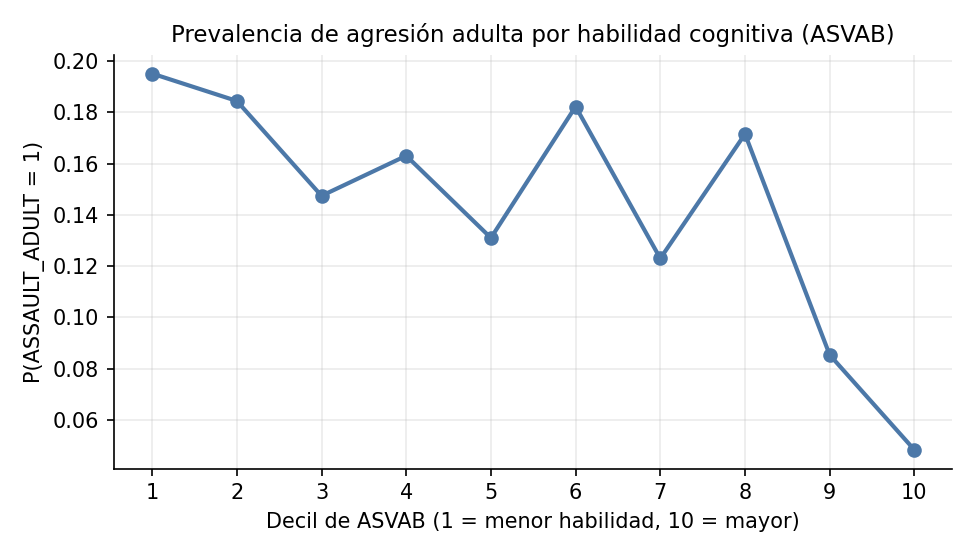{#fig-asvab width=85%}

\newpage

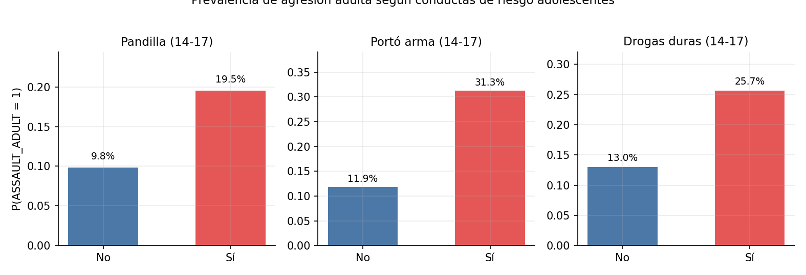{#fig-risk width=90%}

\newpage

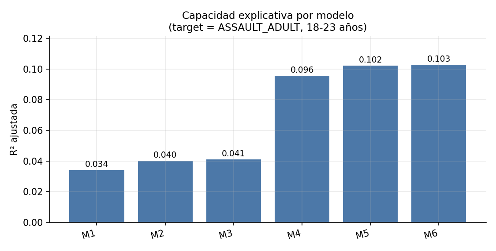{#fig-r2 width=85%}

\newpage

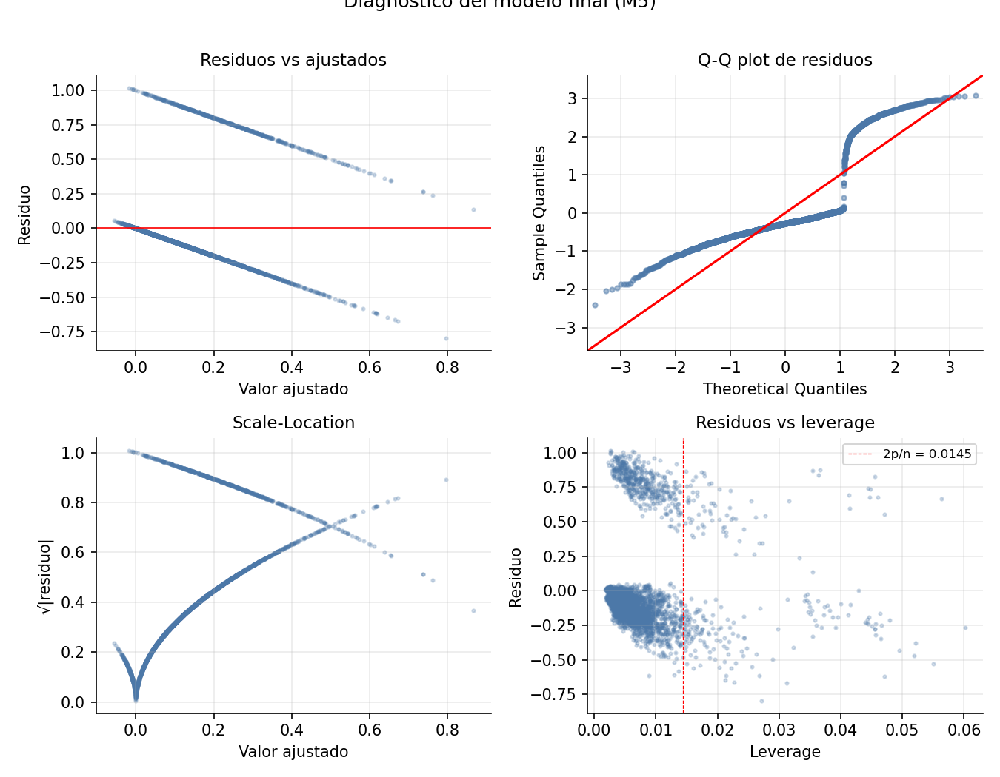{#fig-diag width=90%}

\newpage

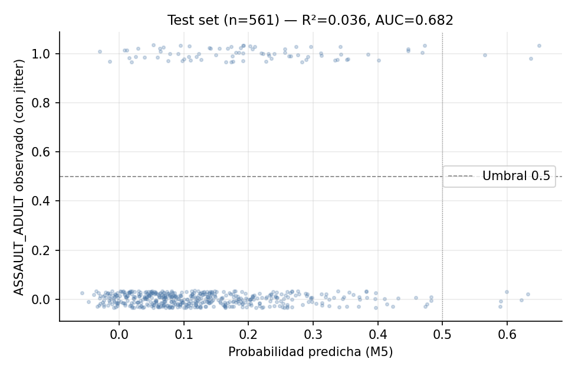{#fig-pred width=85%}

\newpage

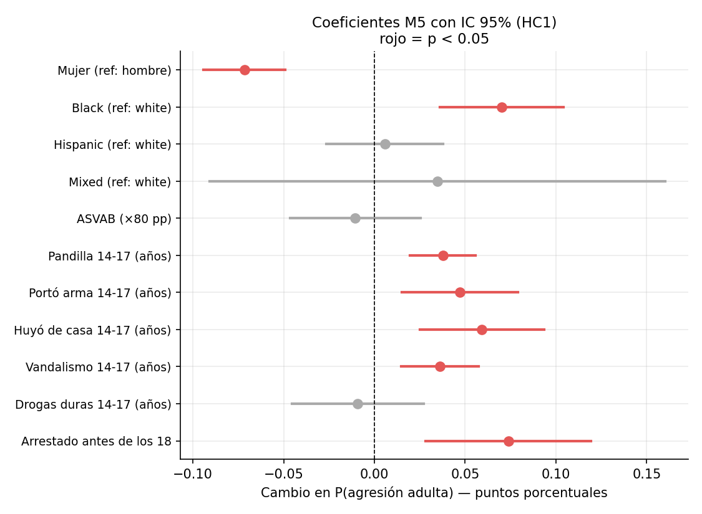{#fig-coefs width=85%}

\newpage

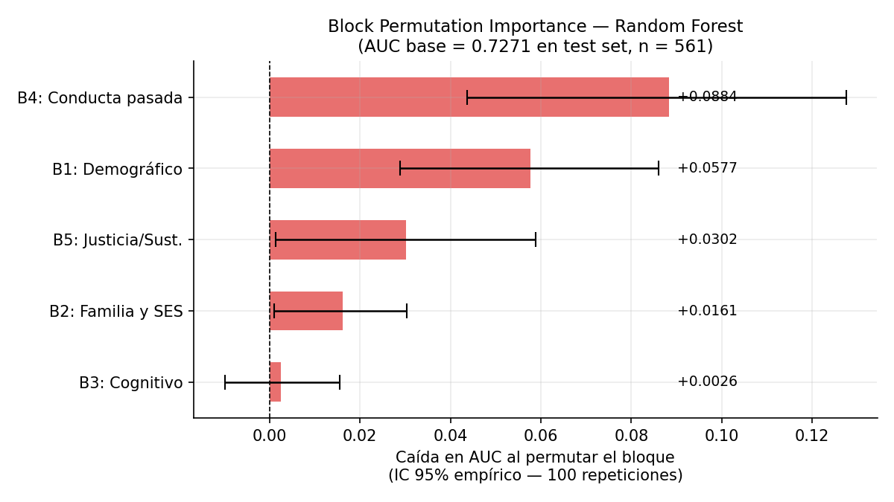{#fig-bpi width=90%}

\newpage

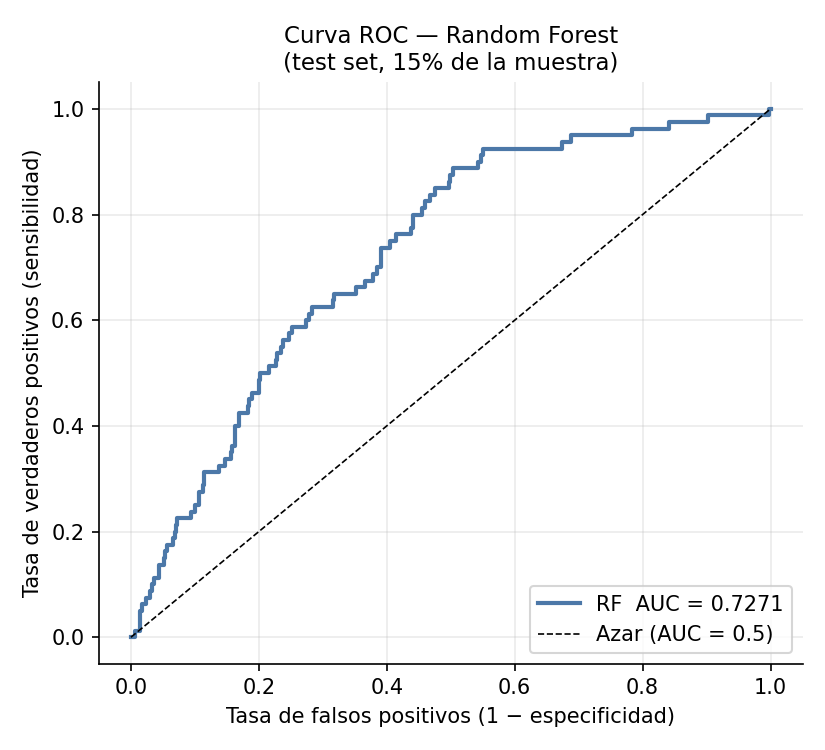{#fig-roc width=75%}

\newpage

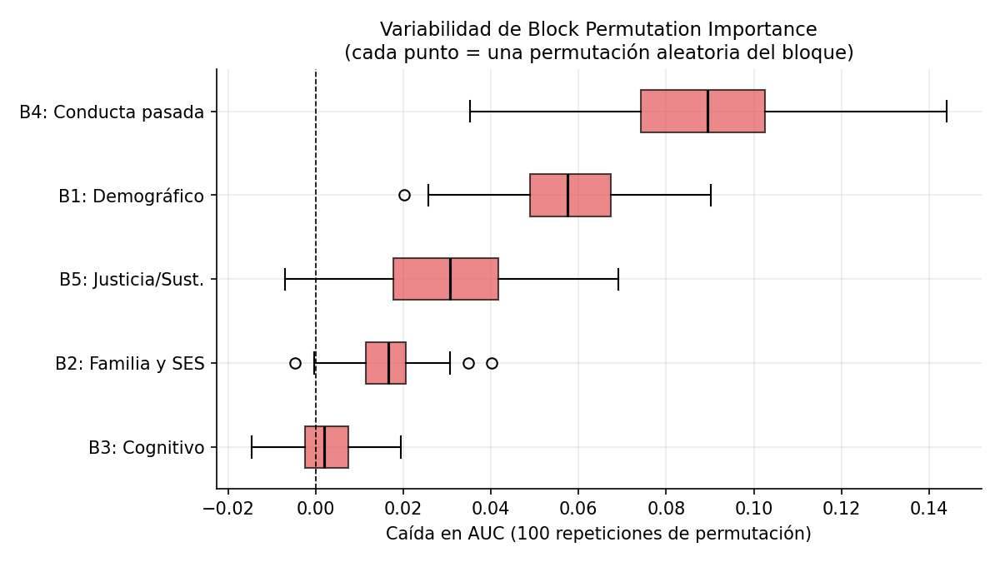{#fig-bpi-box width=90%}

\newpage

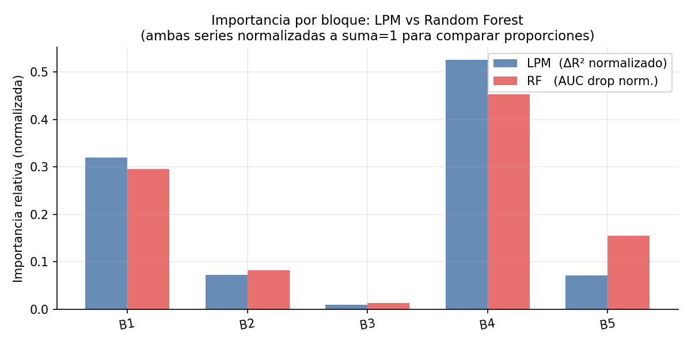{#fig-lpm-rf width=90%}

\newpage

# Referencias {.unnumbered}

::: {#refs}
:::
