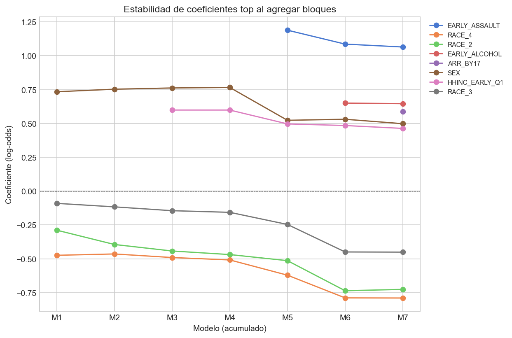

# Mérito intelectual y contexto en la literatura

La violencia juvenil constituye un problema de política pública persistente porque rara vez se agota en el acto puntual: la conducta antisocial adolescente se asocia con secuelas educativas, laborales y de salud que se extienden a la adultez [@moffitt1993; @sampsonlaub1993]. En su capítulo dedicado a predictores de riesgo, @publicsafetycanada2007 sintetiza tres décadas de investigación longitudinal sobre quién termina involucrado en conductas violentas y por qué. La síntesis canadiense subraya un principio que es la base teórica de nuestro diseño: existen "múltiples caminos hacia conductas antisociales" y, aunque ciertos factores predicen la probabilidad de delinquir, **son las combinaciones de factores en períodos críticos del desarrollo** las que elevan la probabilidad de ofensa.

Esa premisa, que @farrington2003 articula bajo el rótulo de criminología del desarrollo y curso de vida, justifica el diseño analítico que adoptamos: en vez de estimar el efecto marginal de un único factor, ordenamos los factores en bloques temáticos coherentes con la literatura y medimos el aporte secuencial de cada bloque al ajuste del modelo. La pregunta empírica es, entonces, no "qué variable predice" sino "qué dimensión de la teoría aporta más información", una pregunta directamente derivable de la taxonomía de @moffitt1993 entre ofensores adolescente-limitados y persistentes a lo largo del curso de vida.

## Hipótesis derivada de la literatura

Tomando la síntesis de @publicsafetycanada2007 como punto de partida, formulamos tres hipótesis ordenadas y comprobables sobre la cohorte NLSY97.

**H1 (dominancia conductual).** Si los hallazgos de @loeberfarrington2000 sobre la persistencia del comportamiento problemático temprano y los de @lipseyderzon1998 sobre los mejores predictores de violencia juvenil son válidos en una cohorte estadounidense reciente, entonces el bloque de conducta antisocial autorreportada entre los 14 y los 17 años debe ser el que más reduzca la incertidumbre sobre la agresión adulta.

**H2 (peso de pares y sustancias).** Si la afiliación con pares desviados es, como sostienen @brendgen1998, @lacourse2003 y @tremblay1995, uno de los predictores más fuertes de la trayectoria antisocial, entonces el bloque que captura conducta de riesgo paralela (sustancias, pandillas, armas) debería ocupar el segundo lugar en el ranking de aporte.

**H3 (atenuación de factores distales).** Si los efectos familiares y socioeconómicos operan en buena medida *a través de* las conductas adolescentes (mediación), como sugieren @jubyfarrington2001 y la lectura desarrollista de @broidy2003, entonces los bloques distales (familia, recursos económicos, capital cognitivo) deberían mostrar asociaciones brutas significativas pero contribuciones incrementales pequeñas una vez controlado el bloque conductual.

Estas hipótesis nos permiten estructurar el análisis no como una expedición exploratoria, sino como un conjunto de predicciones falsables, en línea con la metodología de prueba prospectiva recomendada por @hosmerlemeshow2013.

## Diálogo con dimensiones específicas del Capítulo 2 de Public Safety Canada

La síntesis canadiense identifica ocho dimensiones predictoras; nuestro diseño opera sobre seis de ellas directamente y discute las dos restantes en la interpretación.

*Ajuste emocional y personalidad.* @beyersloeber2003 y @heaven1996 documentan vínculos modestos entre ajuste emocional y ofensa una vez controlados factores familiares y de pares. Aunque la NLSY97 contiene indicadores limitados de personalidad, este resultado apoya nuestra decisión de no priorizar este bloque y permite predecir que su aporte marginal será pequeño.

*Factores familiares.* @arseneault2000, @herreramccloskey2001 y @jubyfarrington2001 destacan que estilos de crianza, exposición a violencia parental y disrupciones familiares predicen delincuencia. Sin embargo, @jubyfarrington2001 explícitamente argumentan que parte del efecto familiar se canaliza vía conducta adolescente, lo que justifica testear el aporte familiar tanto *bruto* como *condicional* en los bloques posteriores.

*Pares.* La predicción central de @brendgen1998, @lacourse2003 y @tremblay1995 es que el peso de los pares es comparable o superior a otros factores proximales, sobre todo cuando se mide afiliación con grupos desviados (pandillas). Operacionalizamos esto mediante el indicador de pertenencia a pandilla entre los 14 y los 17 años, en línea con la conceptualización de @garnierstein2002.

*Actitudes.* @millskronerforth2002 y @zhangloeber1997 sostienen que las actitudes hacia la conducta antisocial están entre los predictores más robustos y son la base teórica de las intervenciones cognitivo-conductuales. La NLSY97 no contiene mediciones extensivas de actitudes; reconocemos esta limitación y discutimos su implicación.

*Estudios multi-dominio.* La síntesis de @stouthamerloeber2002, @wiesnersilbereisen2003 y @broidy2003 muestra que los predictores recurrentes en estudios multi-dominio incluyen rasgos conductuales (crueldad, manipulación, TDAH), actitudes y demografía (edad materna, vecindario). Operacionalizamos lo posible con NLSY97: demografía, edad materna al nacer, número de hermanos, estructura familiar.

*Edad de inicio.* @tolangormansmith2000, @loeberfarrington2000, @elander2000 y @tolanthomas1995 establecen que el inicio temprano predice la mayor persistencia y la mayor probabilidad de violencia adulta. Esta dimensión es la columna vertebral conceptual de nuestra H1: el bloque B5 (conducta antisocial 14-17) opera como proxy operativo de "inicio temprano".

*Resiliencia.* @carrvandiver2001, @stattin1997 y @todis2001 identifican capacidad intelectual, estabilidad emocional y madurez social como factores protectores en jóvenes que desisten. El cuartil más alto de ASVAB en nuestro diseño actúa como proxy parcial de capacidad cognitiva, y los cuartiles más altos de ingreso del hogar como proxy de recursos protectores.

## Aporte metodológico

A diferencia de gran parte de la literatura citada, que típicamente se basa en regresiones por dominio o en análisis de componentes en muestras especializadas, este trabajo (i) compara el aporte de bloques teóricamente especificados en una única muestra nacional probabilística, (ii) triangula un método paramétrico (regresión logística anidada) con uno no paramétrico (*random forest* con permutación), y (iii) computa importancia por permutación a nivel de bloque, lo que resuelve el problema documentado por @strobl2007 de variables correlacionadas que se cubren entre sí en la permutación individual y permite traducir directamente la lógica jerárquica de @publicsafetycanada2007 a un lenguaje cuantitativo. La triangulación conecta con la programática clásica de @nagin1991, que ya alertaba sobre la confusión entre persistencia genuina y heterogeneidad no observada en la predicción de la delincuencia.

# Variables y datos

Usamos los datos del estudio ICPSR 34562, preparado por el Bureau of Justice Statistics con base en la NLSY97 [@icpsr34562]. La encuesta siguió a 8,984 personas nacidas en Estados Unidos entre 1980 y 1984. Tratamos los códigos especiales (no sabe, no contestó, no aplica) como valores faltantes y completamos la matriz imputando las variables explicativas con su mediana.

La variable dependiente $Y_i \in \{0,1\}$ vale uno si la persona reportó haber agredido físicamente a alguien con intención de hacerle daño en al menos una ocasión entre los 18 y los 23 años, y cero en caso contrario. Excluimos los datos posteriores a los 23 años porque incorporan una submuestra de personas en prisión que inflaría la prevalencia. De las 8,984 personas, 8,609 tienen al menos una respuesta válida; 16.9 por ciento reportó agresión adulta.

Organizamos los predictores en siete bloques temáticos cuya secuencia operacionaliza la lógica de "factores distales a proximales" recomendada por la literatura de curso de vida [@farrington2003]:

- **B1 Demográficas.** Sexo, raza o etnicidad, edad de la madre al nacer, número de hermanos. Las dimensiones demográficas figuran como predictores de fondo en los estudios multi-dominio de @stouthamerloeber2002 y @broidy2003.
- **B2 Familia y capital social.** Estructura familiar en 1997 y educación máxima de los padres. Corresponde a la dimensión familiar discutida por @jubyfarrington2001 y @arseneault2000.
- **B3 Recursos económicos.** Razón de pobreza en 1997 e ingreso del hogar 14-17, ambos en cuartiles. Captura adversidad económica, consistente con el énfasis de @heckman2006 en intervenciones tempranas en poblaciones desfavorecidas.
- **B4 Cognitivo.** Puntaje ASVAB en cuartiles. Es nuestro proxy operativo de la dimensión de capacidad intelectual identificada como factor protector por @stattin1997.
- **B5 Conducta antisocial 14-17.** Agresión, destrucción de propiedad, robo bajo y alto, venta de drogas. Operacionaliza el constructo de inicio temprano de @tolangormansmith2000 y @loeberfarrington2000, eje de H1.
- **B6 Sustancias y riesgo 14-17.** Alcohol, marihuana, drogas duras, tabaco, portación de arma y pandilla. Operacionaliza la dimensión de pares desviados de @lacourse2003 y @brendgen1998, eje de H2.
- **B7 Justicia 14-17.** Arresto y encarcelamiento antes de los 17 años. Captura el contacto temprano con el sistema, ligado a la persistencia documentada por @elander2000.

Tras la expansión de las categóricas y los cuartiles, el modelo completo tiene 35 predictores, con una razón observaciones por parámetro cercana a 246.

# Diseño empírico general

El diseño es asociativo y predictivo. El orden temporal entre predictores y resultado garantiza que la información medida en 1997 y entre los 14 y los 17 años no esté contaminada por el outcome, pero no descarta variables omitidas. La pregunta empírica se centra en qué bloques de información reducen más la incertidumbre sobre quién reportará agresión adulta.

## Regresión logística anidada con siete bloques

Estimamos siete modelos logísticos $M_1, \dots, M_7$. El modelo $M_m$ incluye los bloques de $1$ a $m$:
$$
\text{logit}\big(P(Y_i = 1)\big) \;=\; \alpha_m + \sum_{b=1}^{m} \mathbf{X}_i^{(b)\top} \boldsymbol{\beta}^{(b)}.
$$
Estimamos por máxima verosimilitud con errores estándar Huber-White en el modelo final. Para modelos anidados usamos la prueba de razón de verosimilitudes,
$$
\mathrm{LR}_{m \to m+1} \;=\; 2 \big[\,\ell(M_{m+1}) - \ell(M_m)\,\big] \;\sim\; \chi^2_{k},
$$
y reportamos cambio en deviance, AIC y pseudo-R$^2$ de Nagelkerke [@hosmerlemeshow2013].

## Random forest e importancia por permutación

En paralelo entrenamos un *random forest* [@breiman2001] con $B=500$ árboles, profundidad máxima 10, mínimo 20 observaciones por hoja, $\sqrt{p}$ variables candidatas por nodo y pesos balanceados. Validamos con cinco pliegues. Reportamos importancia por permutación individual,
$$
PI_j \;=\; A - \frac{1}{R}\sum_{r=1}^{R} A_{\pi_j^{(r)}},
$$
y por bloque,
$$
PI_{\text{bloque }b} \;=\; A - \frac{1}{R}\sum_{r=1}^{R} A_{\pi_{(b)}^{(r)}}.
$$
La versión por bloque corrige el sesgo de variables correlacionadas señalado por @strobl2007 y permite comparar rankings con la logística anidada.

# Resultados

## Aporte secuencial de los siete bloques

La Tabla 1 reporta los siete modelos anidados. El primer bloque (demográficas) alcanza pseudo-R$^2$ de 0.045. Familia agrega 54.6 puntos de LR ($p<10^{-8}$). Recursos económicos resta 41.3 puntos ($p<10^{-6}$). El bloque cognitivo aporta un cambio menor pero significativo (LR$=10.0$, $p=0.019$). **El salto cualitativo ocurre con el quinto bloque, conducta antisocial temprana, que reduce la deviance en 645.4 puntos con cinco grados de libertad y eleva el pseudo-R$^2$ de 0.065 a 0.181.** Sustancias y justicia aportan 146.4 y 33.0 puntos respectivamente. El pseudo-R$^2$ final de M7 es 0.212.

Este patrón apoya empíricamente la jerarquía predictiva sugerida por @lipseyderzon1998: aunque los factores familiares y económicos son estadísticamente significativos, su aporte incremental se vuelve modesto una vez que entra el bloque conductual. La magnitud relativa del salto en M5 es consistente con el argumento de @loeberfarrington2000 de que el inicio temprano de conducta problemática constituye un marcador especialmente robusto.

Los coeficientes del modelo completo (Tabla 2) refuerzan la lectura. La agresión temprana es el predictor con mayor magnitud (OR$=2.90$), seguido por alcohol temprano (OR$=1.91$), arresto antes de los 17 (OR$=1.80$), sexo masculino (OR$=1.65$), venta temprana de drogas (OR$=1.48$) y pandilla temprana (OR$=1.45$). Que pandilla y venta de drogas aparezcan entre los seis predictores más fuertes, y con magnitudes comparables a sexo, constituye apoyo directo a la conceptualización de @lacourse2003 sobre la trayectoria de membresía en grupos desviados y de @garnierstein2002 sobre el peso de la afiliación pandillera. Los cuartiles bajos del ingreso del hogar entre los 14 y los 17 años retienen coeficientes positivos significativos respecto al cuartil superior, lo que confirma la línea de @arseneault2000 y @heckman2006 sobre el rol de la desventaja económica como factor de fondo, aun después de controlar por conducta.

La Figura 1 del anexo presenta la trayectoria de los coeficientes top. El coeficiente del sexo masculino cae de $0.83$ en M1 a $0.50$ en M7, indicando que parte de la asociación bruta entre sexo y agresión adulta pasa por las conductas tempranas, una mediación consistente con la observación de @broidy2003 sobre el peso de la conducta disruptiva temprana en la diferenciación entre trayectorias masculinas y femeninas. El coeficiente del arresto antes de los 17 años se mantiene estable entre M5, M6 y M7, lo que sugiere que captura información independiente del autorreporte conductual, en línea con @elander2000.

## Importancia del random forest, individual y por bloque

El *random forest* obtuvo AUC de 0.796 en prueba y 0.767 en validación cruzada (SD 0.027). La permutación individual (Figura 2) replica el patrón de los coeficientes: agresión temprana domina con $\Delta\mathrm{AUC}=0.082$, seguida por alcohol temprano, sexo, pandilla y venta de drogas. La aparición de pandilla como cuarta variable más importante en una medida no paramétrica fortalece la lectura del rol causal de los pares planteada por @brendgen1998 y @lacourse2003.

La Figura 3 presenta la permutación por bloque, output central del diseño. El bloque de conducta antisocial temprana acumula $\Delta\mathrm{AUC}=0.134$, casi cuatro veces el siguiente. El bloque de sustancias y riesgo aparece segundo con 0.041 y el demográfico tercero con 0.026. Los bloques familia, recursos económicos, cognitivo y justicia tienen aportes pequeños o no distinguibles de cero una vez se permutan junto con el resto del modelo. Esto no significa irrelevancia absoluta: en la logística anidada estos bloques sí contribuyen significativamente. Lo que dice la permutación por bloque es que, una vez que el bosque ya tiene la información de la conducta temprana, la señal residual de los bloques distales es pequeña, resultado coherente con la hipótesis de mediación que se desprende de @jubyfarrington2001.

## Triangulación entre los dos métodos

La Tabla 3 compara los rankings. La coincidencia en el puesto principal es completa: conducta antisocial temprana domina en ambos métodos. Sustancias aparece segundo o tercero en ambos. Familia, recursos económicos y capital cognitivo oscilan entre los puestos cuatro y siete en ambos métodos con magnitudes pequeñas. La estabilidad del puesto número uno es la evidencia más fuerte de que el ordenamiento es robusto a la elección de modelo.

# Discusión: apoyo, matiz y contradicción frente a la literatura

## Lo que la NLSY97 apoya

Tres líneas clásicas del Capítulo 2 de @publicsafetycanada2007 reciben apoyo empírico fuerte en nuestros datos.

*Primacía de la conducta temprana y la edad de inicio.* H1 se confirma con holgura. El bloque conductual 14-17 acumula el 55 por ciento del incremento total en pseudo-R$^2$ del modelo final, y obtiene una importancia por permutación cuatro veces superior al siguiente bloque. Este resultado es consistente con @loeberfarrington2000, @tolangormansmith2000, @elander2000 y @tolanthomas1995 sobre la centralidad del inicio temprano como marcador de persistencia. También es consistente con la taxonomía de @moffitt1993: los individuos cuya conducta problemática se manifiesta tempranamente son los que con mayor probabilidad continúan con conducta agresiva en la adultez joven.

*Peso autónomo del entorno de pares desviados.* H2 se confirma parcialmente. El bloque de sustancias y riesgo es el segundo en orden de magnitud tanto en la logística como en el bosque. La pandilla temprana retiene un OR de 1.45 incluso después de controlar por el resto del bloque conductual, en línea con @lacourse2003 y @garnierstein2002. El alcohol temprano emerge como segundo predictor más fuerte en magnitud (OR$=1.91$), lo cual conecta con la conceptualización de @brendgen1998 sobre cómo el ambiente de pares desviados normaliza conductas de riesgo paralelas.

*Persistencia versus heterogeneidad.* La estabilidad del coeficiente de arresto temprano a lo largo de M5-M7 es consistente con la lectura de @nagin1991 según la cual el contacto temprano con el sistema captura información no reducible a la conducta autorreportada, posiblemente vía formación de identidad antisocial o etiquetamiento.

## Lo que la NLSY97 matiza o contradice

*Atenuación de los factores familiares y económicos.* H3 se confirma con un matiz importante. El bloque familiar muestra significancia estadística en la logística (LR$=54.6$, $p<10^{-8}$) pero un $\Delta R^2$ de apenas 0.010 y un $\Delta\mathrm{AUC}$ por permutación virtualmente nulo. Esta atenuación es consistente con @jubyfarrington2001, que explícitamente argumentan que el efecto de la disrupción familiar opera en buena medida vía conducta adolescente, pero contrasta con lecturas más fuertes del rol independiente de la familia presentes en @arseneault2000 y @herreramccloskey2001. Una interpretación posible es que la NLSY97 captura aspectos estructurales de la familia (estructura, educación parental) pero no aspectos procesuales (estilo de crianza, exposición a violencia parental, maltrato) que son los que esos trabajos destacan. Es decir, nuestro resultado no contradice la literatura familiar sino que delimita su lectura: lo *estructural* aporta poco; lo *procesual*, no medido aquí, podría aportar más.

*Rol de la capacidad cognitiva.* El bloque ASVAB aporta un cambio significativo pero muy pequeño (LR$=10.0$, $p=0.019$, $\Delta R^2 = 0.002$). Esto matiza la lectura de @stattin1997 sobre la capacidad intelectual como factor protector central: en presencia de información conductual, el aporte autónomo del capital cognitivo se vuelve marginal. La compatibilidad con la literatura es posible si entendemos a la capacidad cognitiva como factor distal cuyo efecto opera vía rendimiento académico y elección de pares, dos canales que entran indirectamente vía B5 y B6.

*Demografía como predictor de fondo.* Que el bloque demográfico aparezca en el segundo o tercer puesto en ambos métodos, principalmente por el sexo, refuerza la observación clásica de @hirschi1969 sobre el peso del control social y de @sampsonlaub1993 sobre trayectorias diferenciales por género. La caída del coeficiente de sexo de M1 a M7 (de 0.83 a 0.50) es interesante: no desaparece, pero se reduce sustancialmente cuando se introducen las conductas tempranas, lo que sugiere que parte de la brecha por sexo en agresión adulta se canaliza vía conductas observables en la adolescencia, hallazgo coherente con @broidy2003.

## Lo que no podemos discutir y por qué importa

Tres dimensiones del Capítulo 2 quedan fuera de nuestra prueba empírica directa.

*Ajuste emocional y depresión.* @beyersloeber2003 destacan vínculos modestos pero específicos entre depresión y delincuencia. La NLSY97 no incorpora un panel completo de medidas de salud mental adolescente con la profundidad de los estudios citados. Su omisión podría sesgar a la baja el aporte de "personalidad" si interactúa con la conducta temprana.

*Actitudes hacia la conducta antisocial.* @millskronerforth2002 y @zhangloeber1997 las identifican como predictores muy fuertes y como base teórica de los programas cognitivo-conductuales. Que nuestro modelo no las incluya implica que el peso atribuido al bloque conductual podría estar absorbiendo varianza atribuible a actitudes, una limitación reconocida que conviene declarar.

*Resiliencia desde un marco positivo.* @carrvandiver2001 y @todis2001 abogan por enfoques basados en fortalezas. Nuestros bloques captan ausencia de riesgo (cuartiles altos de ingreso, ASVAB) pero no presencia activa de factores protectores como mentorías, redes prosociales o competencias sociales medidas directamente.

## Implicaciones para política pública

La concordancia entre nuestros resultados y la síntesis de @publicsafetycanada2007 tiene implicaciones operativas claras. Primero, **las intervenciones que actúan sobre conductas observables 14-17** (programas anti-pandilla, tratamiento de consumo temprano de alcohol, respuesta restaurativa al primer arresto) apuntan al bloque con más señal predictiva, en línea con @loeberfarrington2000 y @heckman2006. Segundo, **las intervenciones sobre factores familiares y económicos no son inútiles**, pero su efecto sobre la violencia probablemente se canaliza vía conducta adolescente, lo que sugiere combinar programas distales con monitoreo conductual proximal. Tercero, **la dimensión de pares y pandillas merece un peso explícito**, ya que tanto la literatura [@brendgen1998; @lacourse2003] como nuestros datos la sitúan en el segundo lugar de la jerarquía predictiva.

# Conclusión

Este trabajo confronta la síntesis de @publicsafetycanada2007 sobre predictores de riesgo con evidencia cuantitativa de la NLSY97. Formulamos tres hipótesis derivadas de la literatura y las probamos con dos métodos complementarios. H1 (dominancia conductual) y H2 (peso de pares y sustancias) se confirman. H3 (atenuación de factores distales) se confirma con el matiz de que la NLSY97 no captura procesos familiares finos, donde la literatura citada localiza buena parte del efecto.

La principal contribución es metodológica: traducimos la lógica jerárquica de la literatura desarrollista a un lenguaje cuantitativo mediante la triangulación de regresión logística anidada y *random forest* con importancia por permutación a nivel de bloque, lo que resuelve el problema de variables correlacionadas señalado por @strobl2007 y permite comparar directamente las predicciones teóricas con los rankings empíricos.

La principal contribución sustantiva es que el ordenamiento de los bloques propuesto por @lipseyderzon1998 y @loeberfarrington2000 se mantiene robusto en una cohorte estadounidense reciente seguida hasta los 23 años, con una única excepción significativa: la dimensión familiar pierde peso autónomo cuando se mide estructuralmente, lo que invita a reactivar las recomendaciones de @jubyfarrington2001 sobre la necesidad de capturar procesos familiares en lugar de meros indicadores estructurales.

Las limitaciones son las esperables: autorreporte de agresión, ausencia de mediciones de actitudes y procesos familiares, diseño asociativo. Estas limitaciones marcan también las extensiones futuras: incorporar instrumentos de actitudes [@millskronerforth2002], paneles de relaciones parentales más finos [@arseneault2000] y trayectorias longitudinales de pares [@lacourse2003].

# Anexo: tablas y figuras {.appendix}

| Modelo | Bloque agregado | $k$ | LR $\chi^2$ | df | $p$ | $\Delta R^2_{\text{Nag.}}$ | $R^2_{\text{Nag.}}$ | AIC |
|:-------|:----------------|:---:|:-----------:|:--:|:---:|:-------------------------:|:-------------------:|:---:|
| M1 | B1 Demográficas | 7 | — | — | — | 0.045 | 0.045 | 7602.8 |
| M2 | + B2 Familia | 14 | 54.6 | 7 | $<10^{-8}$ | 0.010 | 0.056 | 7562.3 |
| M3 | + B3 Recursos económicos | 20 | 41.3 | 6 | $<10^{-6}$ | 0.008 | 0.063 | 7533.0 |
| M4 | + B4 Cognitivo (ASVAB) | 23 | 10.0 | 3 | 0.019 | 0.002 | 0.065 | 7529.0 |
| M5 | + B5 Conducta antisocial 14-17 | 28 | 645.4 | 5 | $<10^{-130}$ | 0.116 | 0.181 | 6893.6 |
| M6 | + B6 Sustancias 14-17 | 33 | 146.4 | 5 | $<10^{-29}$ | 0.025 | 0.207 | 6757.2 |
| M7 | + B7 Justicia 14-17 | 35 | 33.0 | 2 | $<10^{-7}$ | 0.006 | 0.212 | 6728.2 |

: Comparación ANOVA de los siete modelos logísticos anidados. {#tbl-anova}

\newpage

| Variable | Coef. | EE | $z$ | $p$ | OR |
|:---------|:-----:|:---:|:---:|:---:|:--:|
| Agresión temprana (14-17) | 1.065 | 0.074 | 14.33 | $<0.001$ | 2.90 |
| Sexo (hombre) | 0.498 | 0.067 | 7.39 | $<0.001$ | 1.65 |
| Alcohol temprano | 0.646 | 0.090 | 7.15 | $<0.001$ | 1.91 |
| Pandilla temprana | 0.373 | 0.067 | 5.60 | $<0.001$ | 1.45 |
| Arresto antes de 17 | 0.587 | 0.112 | 5.25 | $<0.001$ | 1.80 |
| Venta de drogas temprana | 0.391 | 0.096 | 4.05 | $<0.001$ | 1.48 |
| Ingreso hogar 14-17, Q1 (más bajo) | 0.463 | 0.125 | 3.71 | $<0.001$ | 1.59 |
| Fumar temprano | 0.280 | 0.076 | 3.70 | $<0.001$ | 1.32 |
| Ingreso hogar 14-17, Q2 | 0.378 | 0.113 | 3.35 | $<0.001$ | 1.46 |
| Destrucción de propiedad temprana | 0.256 | 0.080 | 3.21 | 0.001 | 1.29 |
| Razón de pobreza Q3 | $-$0.329 | 0.110 | $-$2.99 | 0.003 | 0.72 |
| Ingreso hogar 14-17, Q3 | 0.321 | 0.108 | 2.97 | 0.003 | 1.38 |

: Coeficientes del modelo M7 (top 12 por $|z|$). {#tbl-coefs}

\newpage

| Bloque | $\Delta R^2_{\text{Nag.}}$ (logit) | Ranking logit | $\Delta\mathrm{AUC}$ (RF) | Ranking RF |
|:-------|:----------------------------------:|:-------------:|:------------------------:|:----------:|
| B5 Conducta antisocial 14-17 | 0.116 | 1 | 0.134 | 1 |
| B1 Demográficas | 0.045 | 2 | 0.026 | 3 |
| B6 Sustancias 14-17 | 0.025 | 3 | 0.041 | 2 |
| B2 Familia | 0.010 | 4 | 0.003 | 5 |
| B3 Recursos económicos | 0.008 | 5 | 0.001 | 6 |
| B7 Justicia 14-17 | 0.006 | 6 | 0.005 | 4 |
| B4 Cognitivo (ASVAB) | 0.002 | 7 | 0.001 | 7 |

: Triangulación de rankings entre la logística jerárquica y el random forest. {#tbl-ranking}

\newpage

{#fig-stability width=92%}

\newpage

{#fig-perm-ind width=92%}

\newpage

{#fig-perm-blk width=92%}

\newpage

{#fig-ranking width=92%}

\newpage

{#fig-edad width=85%}

# Referencias {.unnumbered}

::: {#refs}
:::
